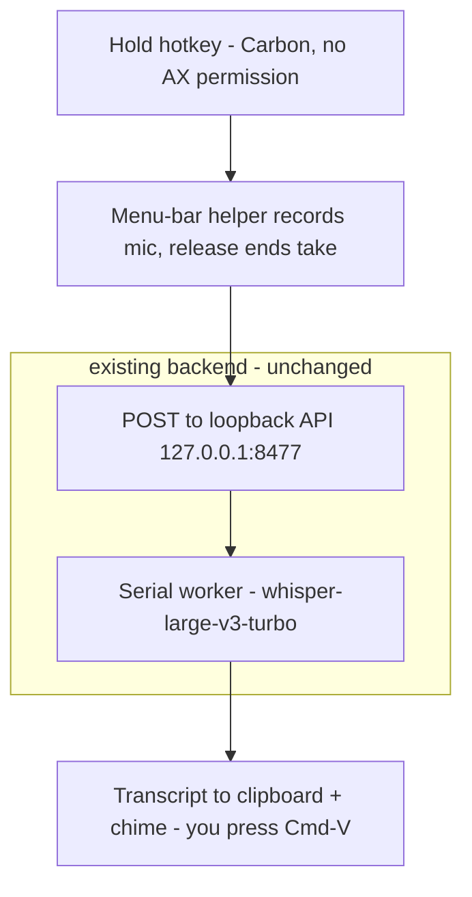
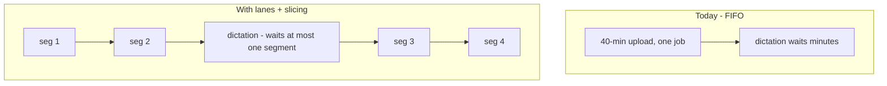
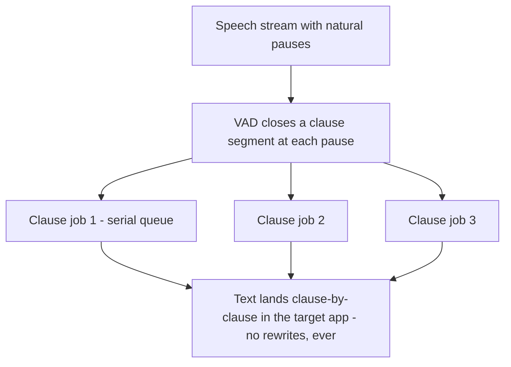

# Ideation: System-Wide Instant Dictation

44 raw ideas across 5 ideation frames → 17 merged candidates → fresh-context verification → **7 survivors**, covering all 5 topic axes.

**Feasibility verdict: yes — recognisably buildable, in stages.** The one structural wall is that a browser tab can never capture a global hotkey or type into another app; every premium tool solves this with a small native helper process. Everything else this project needs already exists: the loopback API, the engine seam, and a measured 2.7 s transcription of 59 s of audio on Metal — meaning a short spoken utterance transcribes in well under a second warm. The premium apps' "instant" feel is mostly *fast batch-on-stop plus automatic paste*, not streaming ASR — which is exactly the shape this backend already has.

---

## Grounding Context

**Codebase Context.** Local-first voice notes: Python 3.12 / FastAPI backend (`src/voice_notes/archive.py` canonical write-once archive, `transcription.py` engine seam with mlx-whisper (Metal) and faster-whisper (CPU int8) adapters, `worker.py` single serial queue, `ingest.py` pipeline) + React 19 browser UI served from loopback `127.0.0.1:8477`. Capture today is the in-tab `R` shortcut and MediaRecorder; the only outbound text flow is a copy-to-clipboard button. Measured latency: 59 s of audio → 2.7 s on Metal (warm); ~25–35 s per minute on CPU platforms. Hard invariants: all engine work rides one serial worker queue (concurrent MLX calls silently corrupt output); notes are write-once (`NoteAlreadyCompleteError`); identity is local-first — no cloud, no accounts, no database. The backlog already shelves "Hotkey / menu-bar capture" and "Transcript-cleanup agent pass"; `docs/solutions/` has nothing on hotkeys or text injection — this is new territory.

**External research (high value).** macOS text injection is a solved cascade: clipboard + synthetic Cmd-V (simplest), Accessibility-API direct insertion (cleanest; needs Accessibility trust), synthetic keystrokes (last resort). Carbon `RegisterEventHotKey` (wrapped for Python by QuickMacHotKey) is the one global-hotkey API that needs *no* Accessibility permission. Secure/password fields block all tools by OS design. Shipping dictation apps (Handy, nerd-dictation, Superwhisper) are predominantly batch-on-stop, not token-streaming. Market gap: local-first with no subscription — Wispr Flow ($15/mo) and Aqua Voice are cloud-bound; users' recurring complaints are privacy and price.

---

## Topic Axes

- **capture-trigger** — global hotkey, menu-bar surface, helper process, permissions
- **text-delivery** — getting text into the focused field: clipboard, paste synthesis, AX insertion
- **latency-transcription** — engine, model, queue discipline, streaming vs batch
- **archive-identity** — does an utterance become a Note; provenance; product-principle fit
- **cross-platform** — macOS-first vs parity; per-OS injection; CI verifiability

---

## Ranked Ideas

### 1. The dictation walking skeleton: thin native helper, hold-to-talk, clipboard-first

**Description:** A small macOS menu-bar helper (~200 lines of Python — PyObjC/rumps in the existing uv venv, or a minimal Swift app later) registers a global hotkey via Carbon `RegisterEventHotKey` (QuickMacHotKey), which requires **no Accessibility permission**. Hold the key, speak, release: the helper records the mic and POSTs the clip to the already-running loopback API, reusing the entire ingest → normalize → transcribe pipeline unchanged. The transcript lands on the clipboard with a soft ready-chime; your own Cmd-V is v0 delivery. The only new OS permission is Microphone. Step two is lifecycle: a launchd login item (`voice-notes --daemon`) so the hotkey works from boot without a terminal command — the browser tab becomes the optional recall window, which `PRODUCT.md` already licenses ("the archive is the truth; the UI is a window").

**Axis:** capture-trigger
**Basis:** `direct:` `docs/ideation/backlog.md:20` — "Hotkey / menu-bar capture — Capture a note without opening the browser tab — shelved" (unshelved with the dictation twist); the in-tab `R` shortcut is scoped to the list view in `frontend/src/App.tsx`. `external:` Carbon `RegisterEventHotKey` is the only public global-hotkey API needing no Accessibility trust (QuickMacHotKey wraps it); a browser tab cannot capture global hotkeys — hard sandbox boundary (verified against pynput docs + prior art: Handy, VoiceInk).
**Rationale:** Five independent ideation frames converged on this shape — the highest-consensus idea in the run. It answers the feasibility question with the smallest possible build: no backend changes, one new permission, shippable in days, and every later idea upgrades this skeleton in place rather than replacing it.
**Downsides:** v0 delivery is "clipboard + your own Cmd-V", not true auto-flush — honest, but visibly short of Wispr Flow. macOS permission grants are per-executable, so a `uv run` helper vs a packaged .app changes the permission story. A resident background process is a new identity commitment for the product.
**Confidence:** 90%
**Complexity:** Low

### 2. Honest tiered delivery behind a TextDeliverer protocol seam

**Description:** Make "text lands in the focused field" a typed seam, cloned from the `Transcriber` playbook (`select_transcriber` is self-described as "the codebase's single platform branch"): a `TextDeliverer` protocol, per-OS adapters, and a `select_deliverer` probe. Delivery is a permission-tiered cascade, surfaced honestly rather than hidden:

- **T0 — Clipboard only** (no permission beyond Mic): transcript on clipboard + notice; user pastes. Ships first.
- **T1 — Clipboard + synthetic Cmd-V** (Accessibility trust): auto-paste into the focused app; clipboard is clobbered (restore after).
- **T2 — AX direct insertion** (Accessibility trust): set the focused `AXTextField`'s value — clipboard untouched, undo behaves like typing; some Electron/terminal apps refuse — fall back to T1.

Three design elements ride along: **(a) focus snapshot** — the delivery target is bound at hotkey-*down* (frontmost app + focused AXUIElement), so text never lands in a window you already left during the transcription window; **(b) delivery receipts** — every delivery names the rung used ("Inserted" / "Pasted" / "On clipboard — Cmd-V"); **(c) a fixed failure doctrine** — secure fields block all tools by OS design, so refusal always resolves the same way: named notice, transcript on clipboard, note saved. Never silent. Per-app outcomes are remembered (a terminfo-style capability table) so the cascade starts at the right rung next time.

**Axis:** text-delivery
**Basis:** `direct:` `PRODUCT.md` — "Recall ends in a paste. Every transcript is one click from the clipboard"; `frontend/src/components/CopyButton.tsx`'s `'idle' | 'copied' | 'failed'` state machine ("Failure persists — the button itself is the retry; no dead end"); `src/voice_notes/app.py:172-196` — the proven platform-branch seam pattern. `external:` mature tools (TypeVox, Voiacast, VoiceInk) converge on exactly this cascade; secure-field blocking is a documented permanent blind spot; Apple has rejected an App Store submission for Accessibility-only text injection.
**Rationale:** This is the product's existing philosophy — "recall ends in a paste" and "state is always honest" — extended across the process boundary. Competitors hide the cascade and users experience its failures as flakiness; surfacing the rung and fixing the failure contract turns the project's honesty principle into the differentiator at exactly the moment competitors are weakest.
**Downsides:** T1/T2 drag in the Accessibility permission model (per-executable grants, reset by macOS updates) that the project has never needed. AX set-value is refused by some sandboxed/Electron/terminal apps, so the capability table is maintenance surface. Clipboard clobbering in T1 races third-party clipboard managers.
**Confidence:** 85%
**Complexity:** Medium

### 3. A priority lane (plus bounded job slicing) in the serial worker

**Description:** `src/voice_notes/worker.py` is a plain FIFO `queue.Queue` with one consumer thread and no priority notion — so a dictation utterance submitted while a 40-minute upload transcribes waits the whole job out, and "instant" silently becomes "wait minutes". The invariant that matters is *serial execution* (MLX Metal corruption, CTranslate2 OpenMP contention), not FIFO *fairness*: keep the one consumer thread, but drain an interactive dictation lane ahead of the bulk lane at every job boundary, and slice long uploads into bounded segments (~60 s of audio each, re-enqueued serially) so the worst-case dictation wait is one segment (~2–3 s on Metal), not one file. Testable with the existing `FakeTranscriber` harness, in the mold of `test_api.py::test_warmup_never_runs_concurrently_with_a_job`.

One consumer thread, always — the MLX single-flight invariant is untouched; only ordering and granularity change.

**Axis:** latency-transcription
**Basis:** `direct:` `src/voice_notes/worker.py:31-48` (verified) — docstring "Single consumer thread over a FIFO queue; capture never blocks on the engine (R6)"; `submit()` is an unconditional `put()` with no priority parameter. `AGENTS.md` — "ALL engine work — including model warmup — must ride the single serial worker queue." `reasoned:` "instant" is a latency-distribution claim; under FIFO, p99 equals the longest queued job, and the only escapes are a second engine instance (forbidden) or bounded work units.
**Rationale:** All five frames flagged this independently: it is the one backend change no dictation design can dodge. Without it, dictation is only instant when the queue happens to be empty — a guaranteed bad demo the moment dictation coexists with note capture. It also pre-solves the next "jump the line" feature (re-derive batch jobs, enrichment).
**Downsides:** Verifier caveats to design around: splice boundaries can cut mid-word (need overlap/VAD-aligned cuts, and accuracy loss at seams must be measured); per-job fixed overhead (temp dir + ffmpeg normalization per job) currently amortizes over whole notes and could dominate at segment granularity. Touching the most invariant-laden file in the codebase warrants a design review first.
**Confidence:** 80%
**Complexity:** Medium

### 4. The dictation-identity decision: is an utterance a Note?

**Description:** Decide deliberately — before any dictation code exists — what a dictated utterance *is*, because the codebase has already made the opposite bet everywhere: every ingested clip becomes a permanent write-once folder (`NoteAlreadyCompleteError`), and `source` is a closed two-value `Literal["mic", "upload"]` (`src/voice_notes/archive.py:64`, `src/voice_notes/ingest.py:180`).

- **Pole A — flight recorder:** every utterance becomes a `source: "dictation"` Note with a `delivered_to` provenance field (target app). The paragraph a Slack box ate is never lost; the archive doubles as a searchable dictation history **no cloud competitor offers** — and startup recovery, retry, and search all work for dictations for free.
- **Pole B — ephemeral pass-through:** dictations never touch the archive: mic → engine → cursor, nothing on disk. `worker.submit()` already accepts any callable, so this is architecturally clean. The pitch: dictated Slack replies are keyboard input, not thoughts worth keeping — archiving them buries real notes under conversational sludge.
- A per-mode hybrid (hold-to-talk = ephemeral; toggle-record = archived) is a legitimate third answer.

Whichever wins, widening the `Literal` is a one-line, type-checker-enforced change today and a codebase sweep later.

**Axis:** archive-identity
**Basis:** `direct:` `src/voice_notes/archive.py:38-39` — "A note's transcript is written exactly once (R11)" (verified); `archive.py:64` / `ingest.py:180` — `source: Literal["mic", "upload"]` (verifier corrected the original `ingest.py:64` citation); `PRODUCT.md` — "The archive is the truth; the UI is a window."
**Rationale:** This is the most consequential fork in the whole direction (seven of the 44 raw ideas orbited it). Defaulting into either pole by accretion is the failure mode: pole-A-by-accident floods `~/VoiceNotes` with one-line folders nobody agreed to; pole-B-by-accident silently breaks "the archive is the truth" and leaves no recovery when a paste fails.
**Downsides:** Pole A changes what the archive *means* (a curated voice-notes record vs a log of everything spoken into any app) and stresses trash/undo at a volume it wasn't designed for. Pole B gives up the flight-recorder differentiator and creates the product's first data path with zero durability.
**Confidence:** 85%
**Complexity:** Low

### 5. VAD clause-commit pseudo-streaming

**Description:** The upgrade from "fast after release" to "text appears while you speak" — without a streaming model. The helper runs cheap voice-activity detection on the mic stream; every natural speech pause closes a clause-sized segment (2–8 s) that is immediately submitted as its own ordinary batch job while the mic keeps recording. Text flushes sentence-by-sentence at pause boundaries. The governing principle is borrowed from simultaneous interpreters: **injected text is irreversible** (you cannot un-type into Slack), so commit only at semantic boundaries — never the provisional-rewrite scheme token-streaming needs (LocalAgreement-2 exists precisely because raw streaming output flickers and retracts).

Streaming at the utterance level; pure batch at the engine level — each clause is a normal serial-queue job.

**Axis:** latency-transcription
**Basis:** `external:` real shipping apps mostly do not token-stream (Handy is batch-on-stop; Superwhisper's pseudo-streaming needed a start-delay patch for dropped first words); LocalAgreement-2 documents why provisional output can't be injected. `direct:` README's measured 2.7 s / 59 s ratio implies a 5–10 s clause transcribes in well under a second warm on Metal. `reasoned:` the interpreter analogy holds structurally — irreversible output channels must trade lag for commit-safety at semantic boundaries.
**Rationale:** This is the highest-fidelity answer to "how do the premium apps make text appear as you speak" that stays compatible with this backend: no engine change, no streaming decoder, and it composes with idea 3's bounded-work-unit discipline (each clause is a small queue job).
**Downsides:** Verifier caveats: the ~100–300 ms/clause figure is arithmetic extrapolation, not a measurement — prototype first; clause-level splitting loses cross-clause context (homophone/punctuation quality at boundaries); per-job overhead (temp dir + ffmpeg spawn per clause) must be measured and likely optimized before this is viable. Build only after ideas 1–3 exist.
**Confidence:** 60%
**Complexity:** High

### 6. macOS-first, with a CI-backed support-claim ladder

**Description:** Scope dictation as macOS-first and extend the project's existing epistemics — "the support claim is exactly as strong as that automation" — to delivery tiers. Injection cannot run on headless CI (AX calls, synthetic keystrokes, and Wayland focus games all need a live GUI session and real permission grants), so: the clipboard tier is the claimable cross-platform tier (testable with xvfb/xclip on Linux, `Set-Clipboard` on Windows); AX/keystroke injection ships macOS-only, labeled "hand-tested" in exactly those words. CPU platforms (25–35 s/min) additionally get an honest asynchronous "mailbox" mode — dictate, keep working, and a notification with a Copy action delivers the transcript when it lands — rather than a fake-instant promise the hardware can't keep.

**Axis:** cross-platform
**Basis:** `direct:` README — "Windows/Linux support is CI-verified (GitHub Actions matrix), not hand-tested… No human-run Windows hardware is in the loop"; `README.md:69` — the 10x Metal-vs-CPU latency gap. `external:` per-OS injection APIs differ substantially (AX/CGEvent vs SendInput vs xdotool/wtype; Wayland compositor-dependent).
**Rationale:** The project's most distinctive trait is honest, automation-backed support claims; dictation is the first feature structurally unable to meet that bar everywhere. Deciding the ladder now prevents the credibility mess of "runs on 3 OSes" quietly covering a feature that only truly works on one.
**Downsides:** Windows/Linux users get a visibly lesser dictation experience, and the README's platform story becomes more nuanced to write. The mailbox mode is a second interaction model to design and maintain.
**Confidence:** 85%
**Complexity:** Low

### 7. Two transcripts: verbatim archive, cleaned delivery

**Description:** Unshelve the backlog's "transcript-cleanup agent pass" with a twist that resolves its latent conflict with the archive contract: cleanup (filler-word scrub, punctuation, casing — rules-based or a small local model) applies **only to the delivery payload** headed for the cursor/clipboard, never to `note.md`. Text dictated into a Slack message must not contain "um"; the archived note must never be a paraphrase of what you actually said. The write-once contract is what makes the split principled: the archive is the audio's truth, the delivery copy is the user's intent.

**Axis:** archive-identity
**Basis:** `direct:` `docs/ideation/backlog.md:32` (verified) — the shelved row as written cleans "before the transcript is handed off and written into note.md", which would violate `write_note_md`'s "the transcript exactly once, atomically" contract; `src/voice_notes/archive.py:160-166`. `external:` transcript cleanup is a core part of Wispr Flow/Aqua Voice's premium feel, done there with cloud LLMs.
**Rationale:** Raw Whisper output pasted into a colleague-facing text box is the quality gap users will actually notice between this and the premium apps. This closes it locally while *strengthening* the archive principle instead of trading against it.
**Downsides:** What got pasted and what got archived now differ — that divergence needs to be visible (provenance noting the cleanup pass) to stay inside "state is always honest." A local cleanup model adds latency to the hot path; rules-based cleanup is cheap but shallower.
**Confidence:** 65%
**Complexity:** Medium

---

## Rejection Summary

| # | Idea | Reason Rejected |
|---|------|-----------------|
| 1 | Become an Input Method (IMKit / TSF / IBus composition channel) | Weak on verification: composition routing only fires when the voice input source is the *active* input method, which conflicts with the hotkey-from-any-app premise; no shipping dictation product established as using it. Interesting research direction, not a candidate. |
| 2 | Dual-model lane (tiny model delivers instantly; large model writes the note) | Basis stretched (the backlog re-derive row is corpus-later, not per-utterance-simultaneous) and the "simultaneous" framing collides with the regression-tested MLX serial invariant. Revisit only as a strictly-serialized variant if ideas 3+5 prove insufficient. |
| 3 | "Perceived-instant stack" synthesis | Inherited the dual-model conflict; its sound components survive independently as ideas 3 and 5. |
| 4 | Pre-roll ring buffer (always-hot mic, ~3 s RAM buffer to catch first words) | Sound and sharp, but tactical polish — and it softens a real privacy-posture change (always-open mic vs today's explicit-record-only). Best raised as a variant inside idea 1's brainstorm. |
| 5 | Menu-bar helper / batch-on-release / clipboard-v0 / daemon lifecycle (4 candidates) | Merged into idea 1 — same direction from four frames. |
| 6 | Delivery cascade / TextDeliverer seam / focus-snapshot / failure doctrine (4 candidates) | Merged into idea 2. |
| 7 | Flight-recorder provenance / honest-ledger synthesis | Merged into idea 4 (pole A and its provenance fields). |

All five topic axes have at least one survivor; no coverage gaps. A fresh-context verifier spot-checked the load-bearing `direct:` citations against the repo (FIFO queue, write-once contract, latency figures, backlog rows, product principles — all confirmed; one line-number citation corrected in idea 4).
