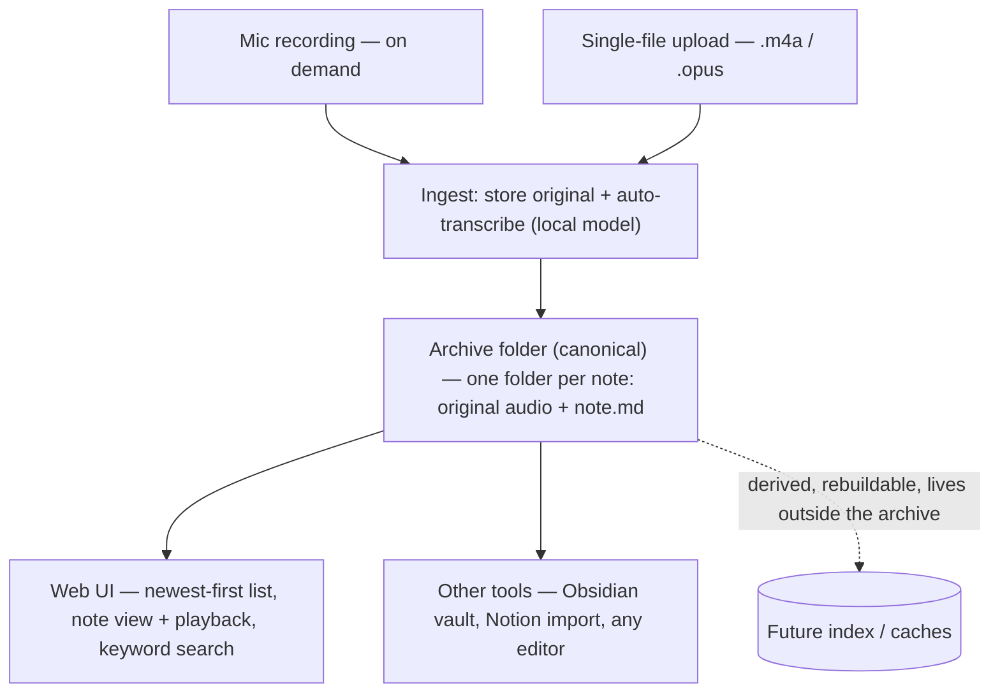
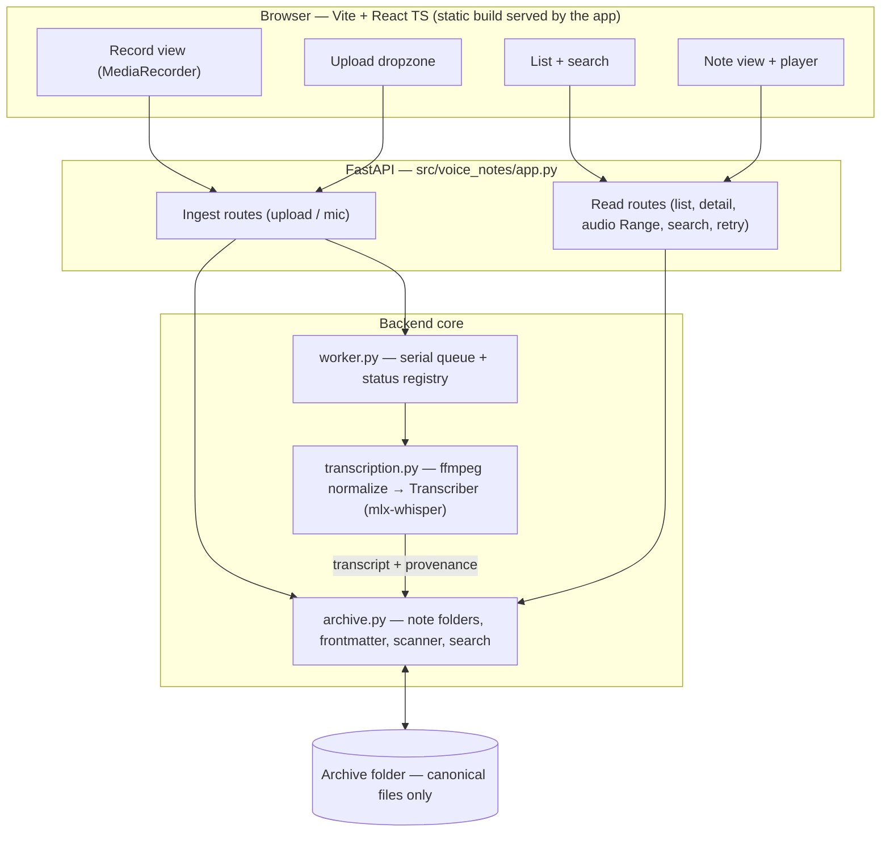
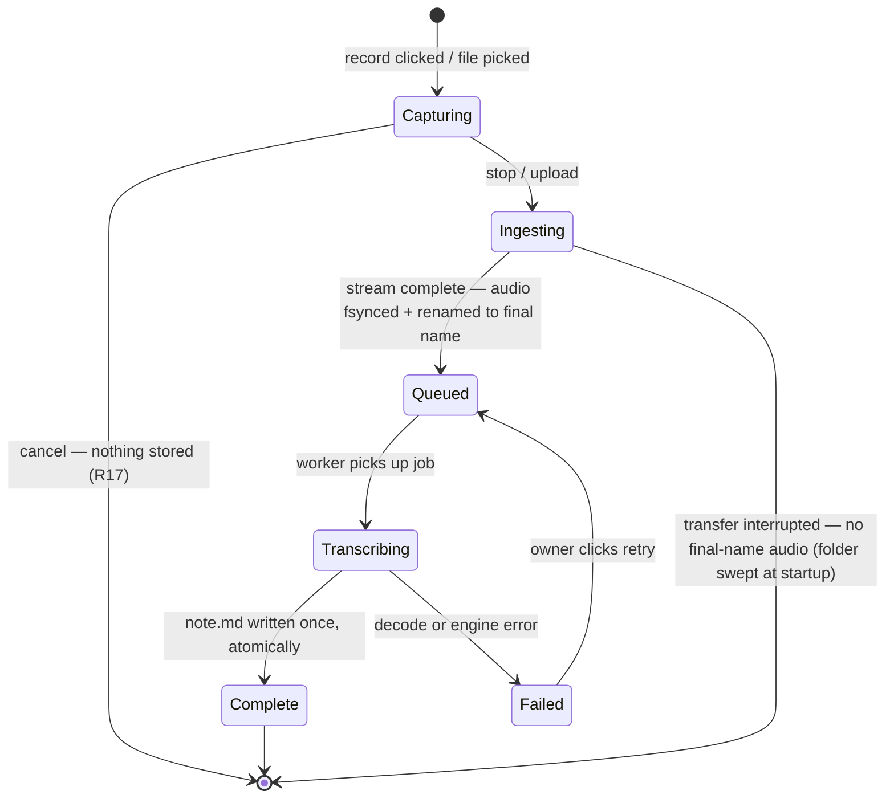

# Local Voice Notes Walking Skeleton - Plan

## Goal Capsule

- **Objective:** Ship the thinnest end-to-end loop of a personal, local-first voice-notes system — record or upload → local transcription → durable tool-agnostic archive → browse and keyword search — proving the "archive outlives the app" substrate with real notes from day one.
- **Product authority:** The Product Contract below; on any conflict it beats the Planning Contract and unit details. Single-user product; the owner is the only stakeholder.
- **Execution profile:** Greenfield repo (not yet git-initialized — initialize at execution start; commits only when the owner asks). Python backend managed entirely through `uv`; TypeScript frontend built once and served by the backend. Runs only on the owner's Apple Silicon Mac; the archive it produces is portable everywhere.
- **Stop conditions:** Surface to the owner instead of guessing if (a) `mlx-whisper` cannot be installed or its model cannot be fetched on the target machine, (b) measured transcription latency misses the ~10s success criterion by more than ~2× after normalization (triggers the engine-swap decision, see KTD-1), or (c) anything appears to require network access in the core capture/transcribe/browse loop.
- **Tail ownership:** v1 ends at the Definition of Done. Deferred capabilities live in Scope Boundaries and are not started opportunistically.
- **Open blockers:** None.

---

## Product Contract

### Summary

A local web app for capturing voice notes without touching the keyboard: record from the microphone on demand or upload a voice file, get a transcript within seconds from a local model, and keep every note as plain files — immutable original audio plus a markdown transcript — in an archive folder any modern notes tool can open. The UI lists notes newest-first and finds them by keyword search. Python backend, TypeScript web UI, fully offline.

### Problem Frame

Thoughts worth keeping currently land in Apple Voice Memos or WhatsApp voice notes, where they sit untranscribed and effectively unfindable; typing them out is exactly the friction voice capture should remove. The market splits the two halves: local dictation tools capture well but remember nothing, while the capture-and-recall products are cloud services.

For a personal memory archive meant to be referred to for years, cloud dependence is a structural risk, not a convenience trade-off — Rewind AI pitched "your data never leaves your device," was acquired, and gave users two weeks to export before shutdown. Separately, local speech-to-text models are improving fast, which means any transcript generated today is the worst that note will ever have — unless the original audio is preserved and derivations remain re-runnable.

### Key Decisions

- **Files are the source of truth; anything derived is a disposable cache.** Each note is a folder of plain files. If an index exists now or later, it lives outside the archive folder and is rebuildable from it — the archive stays pure canonical files, safe to put in any synced location.
- **Portability is enforced as "opens in other tools," not tied to one tool.** Standard markdown + YAML frontmatter + a relative audio embed. The concrete tests: the archive opens as an Obsidian vault, and a note imports cleanly into Notion (the owner's actual tool). Whatever wins note-taking in 2028 reads this folder.
- **Capture polish beats recall machinery in v1.** Keyword retrieval only; semantic/hybrid search is deferred. The owner's success moments are capture-side: speak → note lands, zero keyboard, transcript in seconds.
- **Provenance stamps from note one.** Every transcript records the model, version, and parameters that produced it, so the corpus can be re-transcribed by better models later without touching any stored note.
- **Transcription is automatic on ingest.** No manual "generate" step for either capture path.
- **Originals are preserved byte-for-byte.** Uploads are stored unmodified; mic recordings are stored exactly as captured.



### Key Flows

- F1. Live mic capture
  - **Trigger:** Owner opens the web UI and clicks record.
  - **Steps:** Mic activates on demand; owner speaks; owner clicks stop; ingest runs automatically; transcript appears; the note lands in the archive as original audio + `note.md`.
  - **Outcome:** A durable, transcribed note with zero keyboard input.
  - **Covers:** R1, R3, R4, R5, R6, R7, R8.
- F2. Single-file upload
  - **Trigger:** Owner drags in or picks one audio file (Voice Memos, WhatsApp).
  - **Steps:** File is stored byte-identical as the note's original audio; ingest transcribes automatically; `note.md` is written with source metadata.
  - **Outcome:** The same note shape as F1, from an external recording.
  - **Covers:** R2, R3, R4, R6, R7, R8.
- F3. Browse and retrieve
  - **Trigger:** Owner opens the UI to find something.
  - **Steps:** Notes list newest-first from the archive; owner opens a note to read the transcript and play audio, or types a keyword and opens a match.
  - **Outcome:** A past thought retrieved in a few clicks.
  - **Covers:** R14, R15, R16.
- F4. The archive outlives the app
  - **Trigger:** Owner opens the archive folder with the app absent (or gone).
  - **Steps:** Finder shows one folder per note; `note.md` reads in any editor; the folder opens as an Obsidian vault with playable embedded audio; a note imports into Notion.
  - **Outcome:** The full corpus is usable with no app installed — the export is the format.
  - **Covers:** R9, R10, R12, R13.

### Requirements

**Capture**

- R1. The web UI records from the microphone on demand: recording starts with a single click/tap and no keyboard input, and the mic is active only while recording.
- R2. The UI accepts one audio-file upload at a time, covering common voice-note formats — at minimum Apple Voice Memos (`.m4a`) and WhatsApp (`.opus`) — and rejects unsupported files with a clear message.
- R3. Both capture paths share one ingest: every ingest yields exactly one note holding the original audio byte-for-byte plus a markdown transcript.
- R17. While recording, a cancel control discards the in-progress capture entirely — no note folder, no audio, no request.

**Transcription**

- R4. Transcription runs automatically on ingest using a local model; no manual trigger, and no network access for any core function.
- R5. For a typical voice note, the transcript is visible within seconds of recording end or upload completion (target quantified in Success Criteria).
- R6. The UI shows per-note transcription status (processing / done / failed), and a note in processing never blocks further capture.

**Archive — the canonical store**

- R7. Each note is one folder in the archive containing the original audio file and a `note.md`; the folder name carries the local timestamp and a short slug.
- R8. `note.md` holds YAML frontmatter — at minimum: timezone-aware capture timestamp, capture source (mic or upload, with original filename when uploaded), duration, and transcription provenance (model, version, parameters, transcribed-at) — followed by the transcript and a relative embed of the audio file.
- R9. The app writes only canonical note files into the archive: no databases, caches, or app state. Anything derived is rebuildable from the folder alone and lives outside it. The app tolerates and ignores foreign files that other tools drop in (`.obsidian/`, `.DS_Store`, sync artifacts).
- R10. The archive location is owner-choosable, and pointing the app at an existing archive folder just works — the folder is self-describing.
- R11. The app never mutates a stored note after write in v1: originals are immutable and the transcript is written once at ingest.

**Portability**

- R12. The archive opens as a valid Obsidian vault: notes render, frontmatter parses, and embedded audio plays.
- R13. `note.md` is standard CommonMark + YAML that survives import into mainstream tools (Notion included) with transcript and metadata intact.

**Retrieval**

- R14. The UI lists notes newest-first, sourced from the archive folder itself.
- R15. Opening a note shows its full transcript and plays its audio.
- R16. Keyword search over transcripts and note names returns matching notes; plain keyword matching is sufficient, and semantic ranking is out of scope.
- R18. Every transcribed note offers a one-click copy of its transcript to the clipboard, from the feed and from the note view — recall ends in a paste, not an export.

### Acceptance Examples

- AE1. **Covers R1, R4, R5.** Given the UI is open, when the owner clicks record, says "remember to call the landlord about the deposit," and clicks stop, then with no keyboard input a new note appears at the top of the list with its transcript visible within the Success Criteria latency target.
- AE2. **Covers R2, R3, R8.** Given a WhatsApp voice note `PTT-20260705.opus`, when the owner uploads it, then the archive gains one folder holding that exact file byte-identical and a `note.md` whose frontmatter records the upload source and original filename.
- AE3. **Covers R9, R12.** Given a machine where the app has never run, when the owner opens a copied archive folder in Obsidian, then every note renders with playable audio — no export step, no app.
- AE4. **Covers R6.** Given a long upload still transcribing, when the owner starts a mic recording, then capture proceeds normally while the upload shows processing.
- AE5. **Covers R16.** Given a week-old note containing the word "deposit," when the owner searches "deposit," then that note is listed and opens to its transcript.
- AE6. **Covers R10.** Given an existing archive folder moved to a new location, when the owner points the app at it, then all notes list, open, and search with no migration step.

### Success Criteria

- Zero-keyboard capture: a thought becomes a stored, transcribed note using only mouse/tap — the owner's stated "it works" moment.
- Speed: for a recording up to ~1 minute, the transcript is visible within ~10 seconds of stopping, fully offline on the owner's Apple Silicon Mac.
- Portability: the archive passes the Obsidian-vault test and a `note.md` imports into Notion with content intact, with the app not running.
- Durability: deleting the app and all its app-data loses nothing — a fresh install pointed at the archive restores the full experience.

### Scope Boundaries

**Deferred for later**

- Semantic / vector / hybrid search (the FTS5 + sqlite-vec + RRF pattern is the known landing zone when it comes).
- Batch import of many files (upload stays one-at-a-time in v1).
- The `re-derive` command with diff review — enabled by provenance stamps now, built later.
- Transcript editing/correction and note delete/rename in the UI — in v1, notes are managed as folders in Finder.
- Enrichment (auto-titles, summaries, tags), hotkey/menu-bar capture, thread views — separate future plans.
- Extraction of embedded recording dates from uploaded files (v1 stamps uploads with ingest time; the original filename keeps the trace).
- Multi-device or phone capture; egress-deny sandbox hardening.

**Outside this product's identity**

- Cloud sync service, accounts, multi-user, mobile apps. Backup/sync is achieved by placing the archive folder in an already-synced location, never by product infrastructure.

### Dependencies / Assumptions

- A local STT engine runnable from a Python backend on Apple Silicon exists and meets the speed criterion; engine and invocation choice is planning's (resolved in KTD-1).
- Mic capture stores what the browser recorder produces (typically compressed Opus/WebM); "original" means the captured artifact byte-for-byte, not studio-lossless — acceptable for voice notes.
- Corpus scale is personal (hundreds to low thousands of notes), so folder scans are viable for listing and search at v1 scale.
- Greenfield: no code exists yet; stack preference is Python backend + TypeScript web UI.

### Sources / Research

- Ideation report this plan descends from (top-ranked idea "The archive outlives the app" plus sibling survivors that assume this substrate): `docs/research/2026-07-06-local-voice-notes-ideation.html`.
- External research digest backing the basis claims (Rewind shutdown, local STT landscape, sqlite-vec/FTS5 pattern, prior art Whishper/VoiceInk/Voicenotes): `docs/research/web-research-digest.md`.
- Convergent local-recall pattern for the deferred search upgrade: sqlite-vec + FTS5 hybrid search (Alex Garcia), https://alexgarcia.xyz/blog/2024/sqlite-vec-hybrid-search/index.html.
- Plan-time engine and platform findings (mlx-whisper vs parakeet-mlx vs faster-whisper, MediaRecorder codec matrix, Obsidian accepted formats, Starlette Range advisory) are cited inline at the KTD or risk they justify.

---

## Planning Contract

### Product Contract deltas

Settled with the owner at plan time; the contract text above already reflects them.

- R9 clarified: "contains only canonical files" became "the *app writes* only canonical files and tolerates foreign files." The absolute phrasing was falsified by the contract's own Obsidian test — opening the vault creates `.obsidian/` inside the archive.
- R17 added: a cancel control while recording. Without it, one misclick mints an immutable junk note that could only be removed in Finder.
- Upload timestamp semantics pinned: `captured_at` for uploads is ingest time; the original filename is preserved in frontmatter. Embedded-date extraction moved to Scope Boundaries.
- Browser target pinned: Chrome primary, Safari best-effort (see KTD-4).
- Settled at execution time after the owner's first hands-on UI review (2026-07-06): R18 added — one-click transcript copy is the owner's primary recall pathway; and the Notion-import acceptance check is owner-waived — markdown-as-data-store remains the contract, evidenced by the format round-trip tests and the passed Obsidian-vault check, with Notion/Obsidian de-prioritized as usage targets.

### Key Technical Decisions

- KTD-1. **STT engine: `mlx-whisper` behind a thin `Transcriber` seam.** Default model `mlx-community/whisper-large-v3-turbo`. Rationale: Apple-maintained MLX runs on Metal and comfortably meets the ~10s criterion on Apple Silicon; `parakeet-mlx` is the designated fallback behind the same seam if measured latency or quality disappoints. Rejected: `faster-whisper` (CPU-only on macOS), `lightning-whisper-mlx` (unmaintained since 2024), `pywhispercpp` (Metal support unclear in prebuilt wheels). The seam is one protocol class — not a plugin system — so provenance stamps (R8) come from the seam and an engine swap is a new adapter, not a refactor. Invocation is in-process, a direct library call on the worker thread: a subprocess sidecar buys crash isolation this product doesn't need — the queue is serial and single-user, and KTD-2 makes an engine crash non-destructive (restart, failed, retry) — while costing child-process lifecycle and IPC machinery. The seam still keeps that future cheap: adapters take a WAV path and return plain data, own their model lifecycle behind an explicit warmup hook, and leak no engine types, so a future subprocess or Swift/CoreML sidecar is just another adapter.
- KTD-2. **Audio-first durability; a file's final name asserts its integrity; `note.md` presence marks completeness.** Ingest creates the note folder immediately, streams incoming bytes to a dot-prefixed temp file inside it, fsyncs, and renames to the final audio name only on clean end-of-stream — so audio at its final name is always a complete, durable original (R3), and an interrupted transfer cannot masquerade as one (while a transfer is in flight, the sender still holds the only complete copy). `note.md` follows the same discipline: composed to a temp file, fsynced, atomically renamed, exactly once, on transcription success. Folder states are therefore exact: final-name audio + `note.md` ⇒ complete; final-name audio only ⇒ incomplete — processing while its job is live, failed otherwise, retryable (retry's `note.md` write is still a first write, so R11 holds), and never deleted; neither ⇒ transfer garbage, provably empty of user data, swept at startup so the archive stays canonical-only (R9). Rejected alternative — staging whole note folders outside the archive and renaming them in on success — because a crash after audio has fully arrived must never make possibly-only-copy audio invisible, and the archive may sit on a different volume than any app temp area, where directory renames stop being atomic.
- KTD-3. **Originals stored verbatim; the engine eats a temporary normalized WAV.** Ingest keeps the uploaded/recorded bytes and true container extension untouched (R3); transcription decodes a throwaway 16 kHz mono WAV via `ffmpeg` vendored through `imageio-ffmpeg` (no Homebrew prerequisite; the wheel carries the binary). Duration is read from the normalized WAV. The temp WAV is derived data and is deleted after use — it never enters the archive (R9). The engine adapter never hands the library a file path — path input makes `mlx_whisper` shell out to a PATH-resolved `ffmpeg`, a hidden Homebrew dependency; the adapter decodes the normalized WAV in-process and passes the waveform array, keeping the no-Homebrew guarantee true.
- KTD-4. **Mic capture: MediaRecorder with feature-detection, 1s timeslice, persisted mimeType.** Prefer `audio/webm;codecs=opus` (Chrome), fall back to `audio/mp4` (Safari) via `isTypeSupported`; chunks buffer in the browser during capture and upload as one blob at stop. The actual `recorder.mimeType` travels with the blob and maps to the stored extension (`audio/webm` → `.webm`, `audio/mp4` → `.m4a`). Chrome is the v1 target; Safari notes remain valid archive citizens because the recorded container, whatever it was, is stored and transcodes fine.
- KTD-5. **Serial transcription worker + in-memory status registry + UI polling.** One worker thread consumes a FIFO queue (one model in memory, no GPU contention); FastAPI event loop stays free, so capture never blocks (R6/AE4). Status lives in an in-memory dict keyed by note id — disposable app state, deliberately outside the archive (R9). The model loads lazily in the worker with a non-blocking warmup kicked at app startup, so browse-only sessions never pay the multi-second load. Rejected: FastAPI `BackgroundTasks` (couples CPU-bound work to the request lifecycle) and websockets (polling is enough for one user). GIL note: MLX releases the GIL during Metal compute but the Whisper decode loop holds it in bursts between ops — for one user that is request-latency jitter during transcription, not starvation; U4 pins it with a responsiveness test, and if measurement contradicts it the contained fallback is running the transcribe call in a process pool inside the worker.
- KTD-6. **Search is scan-on-query over `note.md` files — no index anywhere.** Case-insensitive keyword match over transcript bodies and folder names at request time. At personal corpus scale this is milliseconds; building SQLite FTS now would be the exact premature machinery the Product Contract defers. The seam for later is the search function's signature, not a storage layer.
- KTD-7. **Folder naming: `YYYY-MM-DD-HHMMSS-<source-tag>`; no transcript-derived slugs in v1.** Source tag is `mic` or the sanitized upload filename stem; collisions append `-2`. Rationale: the folder must be named when audio lands (KTD-2) — before any transcript exists — and renaming on completion would mutate the note (R11). Names sort chronologically as strings, which R14 exploits. Human-readable titles come from the transcript's first line in the UI, falling back to the capture timestamp when the transcript is empty; durable auto-titles are deferred enrichment.
- KTD-8. **Audio embed uses standard markdown syntax:** `` with a relative path. Obsidian renders standard-markdown audio embeds with a player, and CommonMark parsers pass the node through, degrading to a link-ish artifact rather than breaking (R13). Rejected: `![[wikilink]]` embeds — Obsidian-only syntax that imports into other tools as literal text.
- KTD-9. **Archive location: `VOICE_NOTES_ARCHIVE` env var, default `~/VoiceNotes`.** Created if missing; the resolved path is shown in the UI so the owner always knows where their notes live. Pointing at an existing archive is just setting the variable (R10/AE6). A folder-picker first-run flow is deferred.
- KTD-10. **Pins and stack.** Python 3.12 via `uv` (MLX wheel availability lags newest CPython); `starlette>=0.49.1` (0.39.0–0.49.0 carry a Range-header parsing CPU-exhaustion bug, and Range is what makes audio seeking work); frontend is Vite + React + TypeScript served as a static build by FastAPI (`StaticFiles(html=True)`), no client router; frontend tests use Vitest + React Testing Library — Vitest instead of the owner's usual Jest because it is Vite-native with a Jest-compatible API, RTL preserved.

### High-Level Technical Design

Component and data flow — who touches the archive and how:



Note lifecycle — the states a note passes through and how crash/restart is absorbed. The disk is the only durable state: audio present + `note.md` absent ⇒ incomplete; `note.md` present ⇒ complete. The status registry only distinguishes *processing* from *failed* among incomplete notes.



App restart re-classifies any audio-only folder as Failed (its in-memory job is gone); no auto-requeue — retry stays an owner action, so the app never surprises the archive.

### Risks & Dependencies

- **Latency criterion rests on external benchmarks, not local measurement.** Validate in U3 before building the UI on top (execution note there); a wide miss triggers the Goal Capsule stop condition and the KTD-1 engine swap.
- **First run needs the network once** to download the model (~1.6 GB). This is setup, not core function — R4 governs the capture/transcribe/browse loop. README documents it; the worker surfaces a clear error if the model is absent while offline.
- **MLX wheel churn.** Python 3.13+ support lags; the 3.12 pin (KTD-10) absorbs it. Revisit at the first dependency-upgrade pass.
- **Obsidian does not play `.opus` embeds.** WhatsApp originals render as non-playing embeds inside Obsidian; transcript and metadata still carry the note, and the app's own UI plays them. Mic notes (`.webm`/`.m4a`) play in Obsidian. Accepted v1 degradation, noted in the portability checklist.
- **Safari MediaRecorder variance** (`audio/mp4`, no `.webm`). Chrome is the pinned target; persisted mimeType keeps Safari-captured notes valid rather than corrupt.
- **A browser-tab crash mid-recording loses that recording.** Mic chunks buffer in tab memory until stop (KTD-4); v1 accepts this loss window. Progressive chunk persistence (IndexedDB or streamed upload) is deferred hardening.
- **Disk-full mid-write is absorbed by the naming invariant** (KTD-2): a failed temp write never reaches a final name, so nothing masquerades as complete; incomplete notes become retryable once space frees.

---

## Output Structure

Scope declaration for the greenfield layout; per-unit `Files` lists are authoritative.

```text
stt-poc/
├── pyproject.toml            # uv project, Python 3.12; fastapi, mlx-whisper, imageio-ffmpeg, starlette>=0.49.1
├── README.md                 # prereqs, setup (model download), run commands, archive env var
├── src/voice_notes/
│   ├── __init__.py
│   ├── config.py             # archive-root resolution, settings
│   ├── archive.py            # note folders, frontmatter model, scanner, search, atomic writes
│   ├── transcription.py      # Transcriber seam, ffmpeg normalize, mlx-whisper adapter
│   ├── worker.py             # serial queue, status registry, warmup
│   ├── ingest.py             # ingest pipeline orchestration
│   └── app.py                # FastAPI app, lifespan, routers, static serving
├── tests/                    # pytest; fixtures/ holds tiny audio samples
├── frontend/
│   ├── package.json          # Vite + React + TS; Vitest + RTL; npm run lint/build/test
│   └── src/                  # api.ts, App.tsx, views/ (Record, NotesList, NoteDetail), components/
└── docs/
    ├── plans/                # this plan
    ├── research/             # ideation report, research digest
    └── portability-checklist.md
```

---

## Implementation Units

Dependency order: U1 → (U2, U3 in either order or parallel) → U4 → U5 → U6.

### U1. Scaffold: uv backend, Vite frontend, one-command serve

- **Goal:** A running skeleton — `uv`-managed FastAPI app serving a built React frontend — so every later unit lands in a working app.
- **Requirements:** Enables all; pins the R4 local-only posture.
- **Dependencies:** None.
- **Files:** `pyproject.toml`, `.gitignore`, `README.md`, `src/voice_notes/__init__.py`, `src/voice_notes/config.py`, `src/voice_notes/app.py`, `tests/test_app.py`, `frontend/package.json`, `frontend/vite.config.ts`, `frontend/index.html`, `frontend/src/main.tsx`, `frontend/src/App.tsx`.
- **Approach:** `uv init` with Python pinned 3.12; runtime deps `fastapi`, `uvicorn`, `starlette>=0.49.1`, `mlx-whisper`, `imageio-ffmpeg`, `python-multipart`, `pydantic`; dev deps `pytest`, `httpx`. Frontend scaffolded with Vite (React + TS), ESLint wired to `npm run lint`, Vitest + RTL wired to `npm test`. FastAPI mounts `frontend/dist` via `StaticFiles(html=True)` and exposes `/api/health`; app binds `127.0.0.1` only. A `voice-notes` console script starts the server. README covers: prereqs (macOS Apple Silicon, `uv`, Node LTS), build frontend, run app, first-run model download.
- **Test scenarios:** `/api/health` returns 200 with app metadata; with a built frontend present, `/` serves the SPA index. Test expectation beyond that: none — scaffolding unit; behavior arrives with U2–U5.
- **Verification:** `uv run voice-notes` serves the UI shell locally; `uv run pytest` green.

### U2. Archive core: note folders, frontmatter, scanner, search

- **Goal:** The product's contract as a module — everything R7–R11 promises about bytes on disk, plus listing and keyword search over those bytes.
- **Requirements:** R7, R8, R9, R10, R11, R14 (data source), R16 (mechanism). AE6.
- **Dependencies:** U1.
- **Files:** `src/voice_notes/archive.py`, `src/voice_notes/config.py` (archive-root resolution), `tests/test_archive.py`.
- **Execution note:** Test-first. This module is the archive contract; write the acceptance-shaped tests (folder shape, immutability, foreign-file tolerance, move-and-rescan) before implementation.
- **Approach:** Folder naming per KTD-7 (`YYYY-MM-DD-HHMMSS-<source-tag>`, sanitized stem ≤ ~40 chars, `-2` collision suffix). A Pydantic frontmatter model owns the `note.md` schema: `captured_at` (ISO 8601 with offset), `source` (`mic`/`upload`), `original_filename` (uploads), `mime_type`, `duration_seconds`, `audio` (relative filename), and a `transcription` block (`engine`, `model`, `engine_version`, `params`, `transcribed_at`, `language`). `note.md` = frontmatter, transcript body, then the standard-markdown audio embed (KTD-8). Atomic writes: compose to a dot-prefixed temp file in the note folder, fsync, `os.replace` into place — one helper serving both audio finalization and `note.md` (KTD-2). Scanner classifies folders three ways — `note.md` present ⇒ complete; final-name audio only ⇒ incomplete; neither ⇒ transfer garbage — ignores foreign entries (`.obsidian/`, `.DS_Store`, stray temp files), sorts newest-first by name, and provides the startup sweep that removes garbage folders (never incomplete ones). Search: case-insensitive keyword over transcript bodies and folder names, complete notes only. Archive root per KTD-9, created on demand.
- **Test scenarios:**
  - Creating two notes in the same second yields distinct folders via the collision suffix.
  - Frontmatter round-trips: written `note.md` parses back to the identical model, `captured_at` timezone-aware.
  - Completion write is atomic: after composing, no partial `note.md` is ever observable (temp file then rename), and a leftover temp file from a simulated crash is ignored by the scanner.
  - Scanner: complete and incomplete folders are classified correctly; `.DS_Store`, `.obsidian/`, and unknown loose files in the archive are ignored without error (R9).
  - A folder holding only temp artifacts (no final-name audio, no `note.md`) is transfer garbage: excluded from listings and removed by the sweep; audio-only folders are never removed by anything.
  - Newest-first ordering holds across day boundaries (string sort of names).
  - Search finds a keyword in a transcript and in a folder name; misses return empty; incomplete notes never appear in search results.
  - Covers AE6. Build a small archive, move the directory, point the module at the new path via env: all notes list, open, and search — no absolute paths stored anywhere in the archive.
- **Verification:** `uv run pytest tests/test_archive.py` green; a generated note folder opened in a text editor reads as described by R8.

### U3. Transcription seam: ffmpeg normalize, mlx-whisper adapter, serial worker

- **Goal:** Audio in, transcript + provenance out — behind a seam that keeps the engine swappable — with a serial worker so transcription never blocks the app.
- **Requirements:** R4, R5, R6 (mechanism). Feeds R8's provenance block.
- **Dependencies:** U1.
- **Files:** `src/voice_notes/transcription.py`, `src/voice_notes/worker.py`, `tests/test_transcription.py`, `tests/test_worker.py`, `tests/fixtures/` (tiny `.m4a`/`.opus`/`.webm`/silence samples).
- **Execution note:** Validate the latency criterion here, before U4/U5 build on top: run the slow integration test once on the real engine and record stop→transcript time for a ~1-minute fixture. A wide miss fires the Goal Capsule stop condition (engine swap per KTD-1) while the change is still one adapter.
- **Approach:** `Transcriber` protocol: normalized WAV path in, `TranscriptionResult` out (`text`, `language`, provenance fields per KTD-1). Normalization (KTD-3): `imageio-ffmpeg`'s bundled binary via subprocess → temp 16 kHz mono s16 WAV; decode failure raises a typed error; duration read from the WAV header. `MlxWhisperTranscriber` decodes the normalized WAV in-process and calls `mlx_whisper.transcribe` with the waveform array and the default model id — never a file path, which would shell out to a PATH-resolved `ffmpeg` the vendored wheel cannot satisfy (KTD-3); params recorded into provenance. The protocol carries an explicit warmup hook so adapters own their model lifecycle; the worker depends on the protocol alone, with the concrete adapter injected at app startup (KTD-1). Worker (KTD-5): single consumer thread over a FIFO queue; status registry maps note id → queued / transcribing / failed (with error message) / done; the model loads lazily on first job, and app startup kicks the warmup hook on a non-blocking thread. All engine work stays off the event loop.
- **Test scenarios:**
  - A fake `Transcriber` satisfies the protocol and the worker drives it end-to-end (fast path for all API tests in U4).
  - Normalization produces 16 kHz mono WAV from each fixture container (`.m4a`, `.opus`, `.webm`); duration extracted matches the fixture within tolerance.
  - A corrupt/non-audio file fails normalization with the typed error and the job lands in failed with a human-readable message.
  - Two enqueued jobs run strictly serially; the second reports queued while the first transcribes (feeds AE4).
  - A silent fixture completes as done with empty transcript text — silence is a note, not an error.
  - Provenance: result carries engine name, model id, engine version, params, and a transcribed-at timestamp.
  - Slow (marked, excluded by default): real `mlx-whisper` transcribes a spoken fixture and the transcript contains the expected keyword.
  - Slow (marked): the real engine transcribes with no `ffmpeg` resolvable on PATH (scrubbed test environment) — proving the adapter's array input removed the hidden PATH dependency.
- **Verification:** `uv run pytest tests/test_transcription.py tests/test_worker.py` green; `uv run pytest -m slow` transcribes on the real engine and the measured latency is recorded.

### U4. Ingest pipeline and HTTP API

- **Goal:** Wire archive and transcription into one ingest path exposed as the app's API — upload or mic blob in, durable transcribed note out, with status, retry, playback, and search endpoints.
- **Requirements:** R2, R3, R4, R5, R6, R14, R15 (audio serving), R16 (endpoint). AE2, AE4, AE5.
- **Dependencies:** U1, U2, U3.
- **Files:** `src/voice_notes/ingest.py`, `src/voice_notes/app.py` (routers), `tests/test_api.py`.
- **Approach:** Ingest (KTD-2): create the note folder, stream the original bytes unmodified to a temp name (byte-count cap ~200 MB enforced while streaming), fsync and rename to the final audio name only on clean end-of-stream — a client disconnect leaves no final-name audio — then enqueue the job; on worker success compose and atomically write `note.md`; on failure record status. Upload validation: extension allow-list (`.m4a .opus .webm .mp3 .wav .ogg .flac .aac`), rejection message names the accepted formats (R2). Mic blobs map mimeType → extension per KTD-4. Routes (async, Pydantic `response_model`, one `APIRouter` per domain): `POST /api/notes` (multipart upload), `POST /api/notes/mic` (recorded blob + mimeType), `GET /api/notes` (newest-first list with per-note status merged from the registry), `GET /api/notes/{id}`, `GET /api/notes/{id}/audio` (`FileResponse` — Starlette serves Range for seeking), `POST /api/notes/{id}/retry` (incomplete folders only), `GET /api/search?q=`. Startup recovery: scan for audio-only folders and mark them failed — visible and retryable, never auto-requeued — and sweep transfer-garbage folders (KTD-2).
- **Test scenarios (fake transcriber throughout; real engine stays in U3's slow marker):**
  - Covers AE2. Uploading a fixture `.opus` stores it byte-identical (hash compare) and the completed `note.md` frontmatter records `source: upload` and the original filename.
  - Upload of a `.txt` is rejected with a message naming supported formats; nothing is written to the archive.
  - Oversized stream is rejected (413); no final-name audio is left behind.
  - An upload aborted mid-stream (simulated client disconnect) leaves no final-name audio and never appears in listings; after the startup sweep the garbage folder is gone.
  - While a slow fake transcription runs, list and detail endpoints respond within a bounded time — browse and capture never stall behind the engine (strengthens AE4).
  - Mic blob with `audio/mp4` mimeType stores as `.m4a`; with `audio/webm` stores as `.webm`.
  - List shows the note as processing immediately after ingest and done after the worker completes; detail returns full transcript.
  - Covers AE4. A second ingest is accepted and listed while the first is still transcribing.
  - Retry on a failed (audio-only) folder produces a complete note; retry on a complete note is a no-op error (409).
  - Startup with a pre-existing audio-only folder lists it as failed and retryable.
  - Audio endpoint honors Range: bytes request returns 206 with correct slice.
  - Covers AE5. Search endpoint finds a seeded transcript keyword; empty `q` returns an empty result, not an error.
- **Verification:** `uv run pytest tests/test_api.py` green; a manual curl upload of a real Voice Memos `.m4a` lands a complete note on disk.

### U5. Web UI: record, upload, browse, search

- **Goal:** The zero-keyboard capture surface and the recall views — the product as the owner experiences it.
- **Requirements:** R1, R2 (client half), R6, R14, R15, R16 (client half), R17, R18. AE1.
- **Dependencies:** U1, U4.
- **Files:** `frontend/src/api.ts`, `frontend/src/App.tsx`, `frontend/src/views/RecordView.tsx`, `frontend/src/views/NotesList.tsx`, `frontend/src/views/NoteDetail.tsx`, `frontend/src/components/Recorder.tsx`, `frontend/src/components/UploadDropzone.tsx`, `frontend/src/components/SearchBox.tsx`, `frontend/src/components/StatusChip.tsx`, `frontend/src/components/CopyButton.tsx`, colocated `*.test.tsx` files.
- **Approach:** Navigation model: NotesList is the landing view with the Record surface persistently reachable from it; opening a note swaps to NoteDetail, whose explicit Back control returns to the list preserving scroll position and any active search — with no router, that control is the only way back. Recorder per KTD-4: `isTypeSupported` feature-detection, `start(1000)` timeslice buffering, stop → blob POST with the actual `recorder.mimeType`; cancel discards buffered chunks with no request (R17); `beforeunload` guard while recording; explicit states for permission-denied and no-mic; elapsed-time display; mic released on stop/cancel (R1). Both capture surfaces show a brief in-flight state between stop/select and the ingest response, plus an inline ingest-failure state (oversized, disconnect, server down) distinct from the permission states; a failed mic-blob POST retains the buffered blob behind a retry-send action, and the `beforeunload` guard stays active until the POST succeeds or the owner explicitly discards. Upload: picker + drag-drop, single file, client-side extension check mirroring the server allow-list; a drop containing multiple files is rejected whole with the same message pattern as unsupported types. List: newest-first cards with `StatusChip`, polling every ~2s only while any note is non-terminal, retry button on failed notes; an empty archive renders an empty state with a short message and a direct call to Record; only done cards navigate to NoteDetail — processing cards show their status, failed cards their status and retry, neither navigates (R15 applies to complete notes). Detail: transcript, `<audio controls>` against the audio endpoint (seeking via Range), capture metadata. Search box → results as the same note cards; clearing the search (or submitting an empty query) redisplays the already-fetched newest-first list client-side, never calling the search endpoint with an empty string (whose contract returns an empty set, U4). View state in `App` — no router. All functions carry explicit return types.
- **Test scenarios (Vitest + RTL, MediaRecorder and fetch mocked):**
  - Covers AE1 (client half). Record → stop posts a blob whose mimeType matches the mock recorder, and the new note appears in the list.
  - Cancel mid-recording sends no request and buffered chunks are dropped (R17).
  - Permission denied renders the guidance state, not a crash; record button re-enabled after recovery.
  - Choosing an unsupported file shows the rejection message without a network call.
  - List renders processing, failed (with retry button), and done states; clicking retry fires the retry call.
  - Polling stops once all notes are terminal (no runaway timers).
  - Search submit renders matching results; empty result renders an empty state.
  - Clearing the search box restores the full newest-first list with no search request fired.
  - Zero complete notes renders the list's empty state with its call to Record.
  - A note with an empty transcript renders its capture-timestamp fallback title, not a blank card.
  - An ingest-request failure shows the inline failure state; for mic, the blob is retained and retry-send re-posts the identical blob — no silent loss.
  - A multi-file drop is rejected whole with the single-file message; nothing uploads.
  - Processing and failed cards do not navigate; a done card opens NoteDetail, and Back restores the list with scroll and active search intact.
  - Done cards (and the note view) copy the full transcript to the clipboard in one click with copied/failed feedback; processing and failed cards offer no copy control (R18).
- **Verification:** `npm test` and `npm run lint` green in `frontend/`; `npm run build` output served by the backend records and plays a real note in Chrome.

### U6. Walking-skeleton proof: portability checks, latency measurement, docs

- **Goal:** Prove the plan's identity claims — the archive outlives the app, and capture meets the speed bar — and leave the run instructions accurate.
- **Requirements:** R5 (measured), R10, R12, R13. AE1, AE3, AE6. All four Success Criteria.
- **Dependencies:** U3, U4, U5.
- **Files:** `tests/test_portability.py`, `docs/portability-checklist.md`, `README.md` (final pass).
- **Approach:** Automated: archive-move test at the app level (fresh app instance pointed via env at a relocated archive copy — AE6 end-to-end). Manual, recorded as a checked-off checklist in `docs/portability-checklist.md`: open the archive as an Obsidian vault (notes render, frontmatter appears as Properties, `.webm`/`.m4a` embeds play; note the `.opus` playback limitation); import a `note.md` into Notion (transcript + metadata intact); delete-app durability (run from a fresh clone against the untouched archive); AE1 stopwatch runs — record the measured stop→transcript time for a ~1-minute note in the README against the ~10s criterion. Run the U3 slow engine test as part of this gate. README final pass: setup, model download, archive env var, measured latency, engine/model provenance statement.
- **Test scenarios:** Covers AE3/AE6 as above (one automated, one checklist). Test expectation beyond that: none — verification unit; it adds no feature logic.
- **Verification:** All checklist items checked with results recorded; `uv run pytest -m slow` green; measured latency within the Success Criteria bound (or the stop condition fired).

---

## Verification Contract

| Gate | Command | Proves |
|---|---|---|
| Backend suite | `uv run pytest` | Archive contract, worker, ingest, API — fast, fake engine |
| Engine integration | `uv run pytest -m slow` | Real mlx-whisper transcribes; latency measured (U3/U6) |
| Python format + lint | `uv run ruff format --check .` and `uv run ruff check .` | Style gates (the PostToolUse hook keeps these green during dev) |
| Python types | `uv run pyrefly check` | Typed boundaries hold |
| Frontend tests | `npm test` (in `frontend/`) | Recorder, cancel, list states, search behaviors |
| Frontend lint | `npm run lint` (in `frontend/`) | Owner's pre-commit convention |
| Frontend build | `npm run build` (in `frontend/`) | The bundle FastAPI actually serves |
| Portability + latency | `docs/portability-checklist.md` executed | Obsidian vault, Notion import, delete-app durability, AE1 stopwatch |

The manual checklist is a first-class gate: R12/R13 and the durability Success Criterion cannot be proven by unit tests.

---

## Definition of Done

- All units U1–U6 landed in dependency order; every requirement R1–R17 implemented (none deferred beyond the Product Contract's own Scope Boundaries).
- AE1–AE6 demonstrated: AE2, AE4, AE5, AE6 by automated tests; AE1 and AE3 by the executed checklist.
- Success Criteria met and evidenced: zero-keyboard capture shown; measured transcript latency for a ~1-minute note recorded in the README and within ~10s; Obsidian-vault and Notion-import checks passed; delete-app durability check passed.
- Every Verification Contract gate green, including the slow engine test run at least once on the owner's machine.
- A fresh clone following only the README reaches a working app pointed at an existing archive.
- Cleanup: no dead-end or experimental code from abandoned approaches remains; temp WAVs and scratch files are not left in the repo or the archive.
