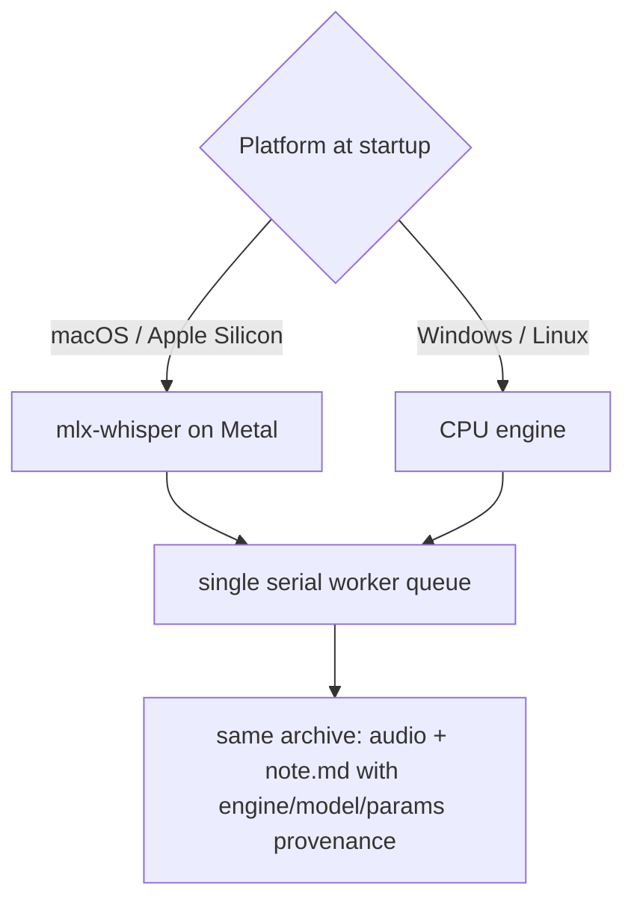
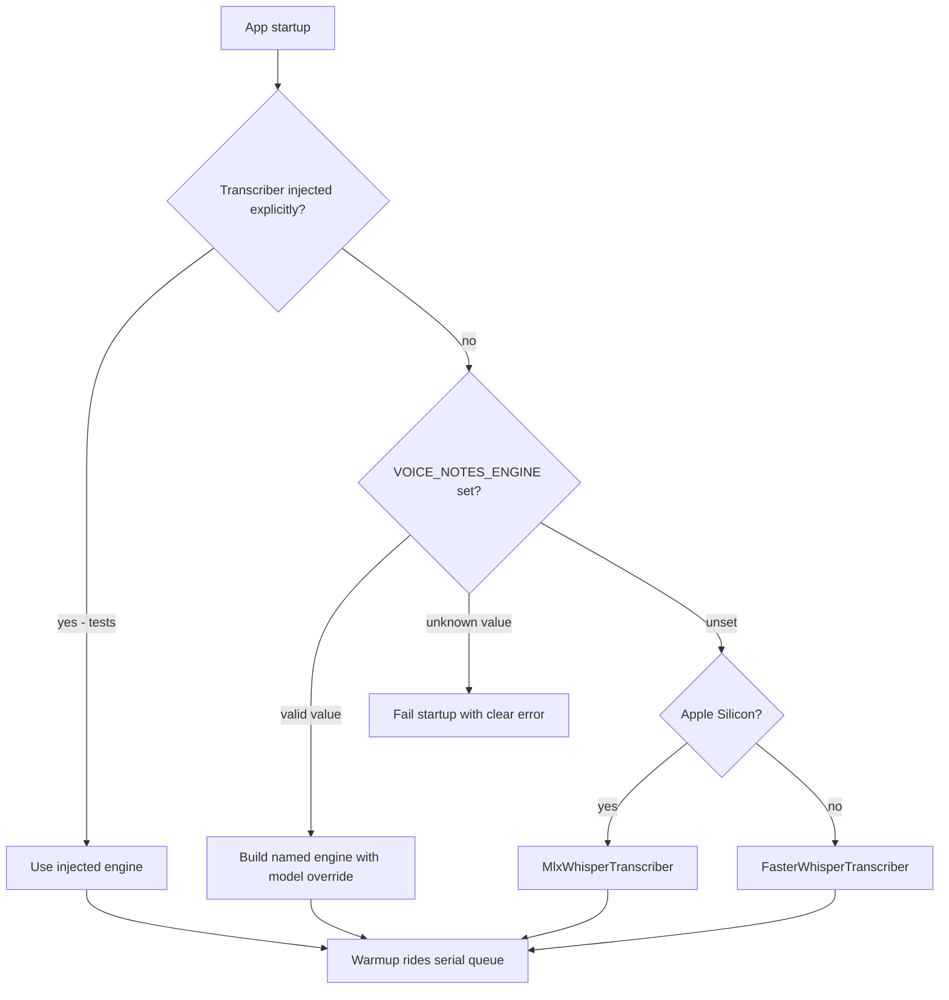
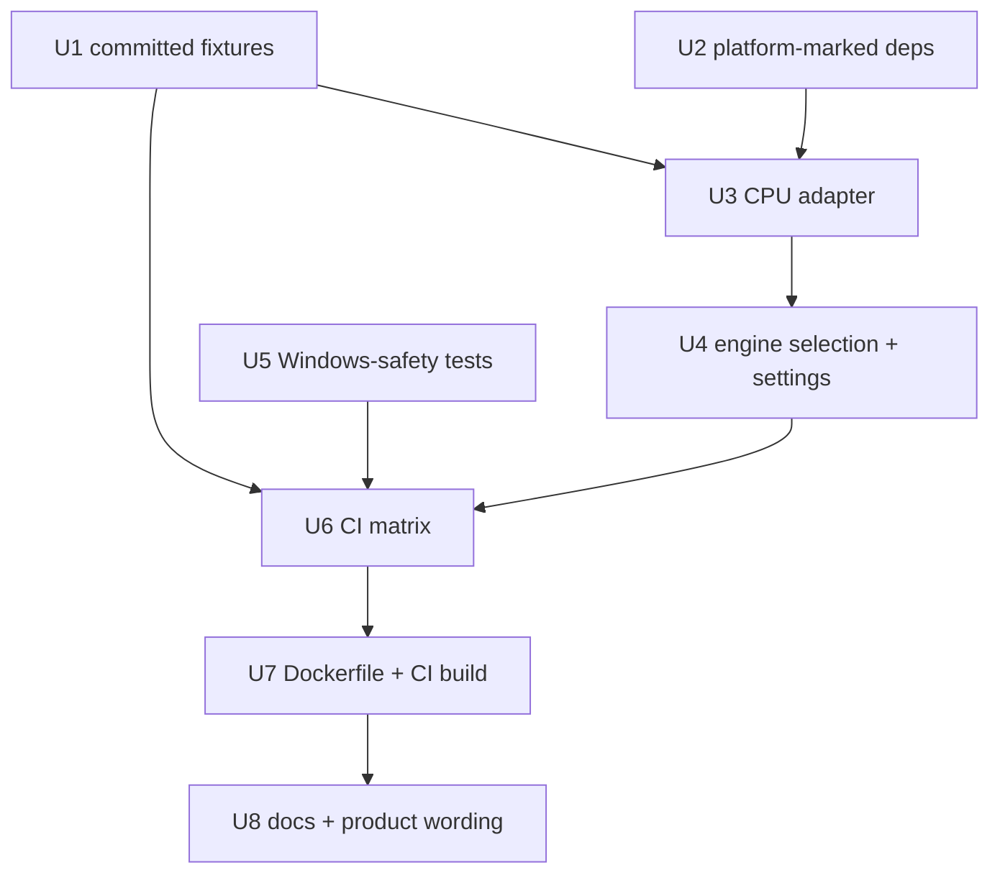
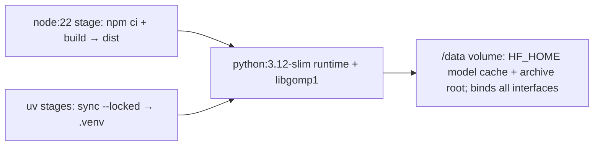

# Multi-platform Support (Windows & Linux) - Plan

## Goal Capsule

- **Objective:** A Windows or Linux machine can clone the repo, sync, and run voice-notes with full feature parity — while the Mac's MLX/Metal runtime and the on-disk archive format stay untouched.
- **Product authority:** the Product Contract in this file, then PRODUCT.md / DESIGN.md / AGENTS.md conventions. PRODUCT.md's macOS-specific wording updates as part of this work (R16). Conflicts get surfaced, not guessed around.
- **Execution profile:** code. Work the units in dependency order (U1, U2, U5 have no prerequisites); verify each unit before moving on. The web UI and keyboard map are not touched.
- **Stop conditions:** stop and surface if the work would change product scope or the archive format, if the macOS suite cannot stay green, or if a dependency breaks the wheels-only posture on any target OS.
- **Open blockers:** none.

---

## Product Contract

### Summary

Make clone → sync → run work identically on macOS, Windows, and Linux. A CPU transcription engine joins mlx-whisper behind the existing `Transcriber` seam with platform-aware dependencies, proven by the repo's first CI matrix; a CI-built Linux Dockerfile ships as an optional server/repro distribution. The archive format, web UI, and keyboard workflow do not change.

### Problem Frame

The app is locked to macOS on Apple Silicon by exactly one hard dependency: the transcription engine. `mlx-whisper` is unconditional in `pyproject.toml`, so `uv sync` fails on any other platform before the app can even start. Everything else — archive mechanics, browser mic capture, the keyboard map — is already portable, so the platform lock is much narrower than the README's "macOS only" suggests. The owner has no Windows hardware; the want is principle-driven portability ("anyone can clone and run this"), which makes automated verification the only proof available and puts the "transcript within seconds" promise — calibrated on Metal — under new scrutiny on GPU-less machines.

No new user-facing flows are introduced; the existing capture/recall flows apply unchanged on every platform (R10), so this contract carries no Key Flows section.

### Key Decisions

- **Native runtime per platform, not container-first Windows.** Windows users run the app natively via `uv`; Docker Desktop is not a prerequisite. Containerizing the Windows path would keep two runtimes anyway (the Mac cannot join a Linux container without losing Metal), and the archive's fsync + atomic-rename durability is native-filesystem-clear but murkier across a container VM's bind-mount bridge.
- **Two engines, one contract.** The platform picks the engine at startup behind the existing `Transcriber` protocol — mlx-whisper on Apple Silicon, a CPU engine on Windows/Linux — with a configuration override. The seam was designed for exactly this swap.
- **Balanced, adjustable CPU default.** The Windows/Linux default model targets roughly-real-time short memos on a modern GPU-less CPU rather than holding the Mac's "seconds" promise; the model is a user setting and the quality gap is documented honestly. (Planning outcome: the same model family the Mac uses clears this bar at int8 on CPU — see KTD-3.)
- **Linux is claimed and tested, not incidental.** The same engine work unlocks Linux; one Ubuntu CI lane makes the claim honest, and a Windows user cloning inside WSL2 gets a supported path by construction.
- **The Dockerfile is optional and CI-built.** It exists for server/repro use, is explicitly not the Windows answer, and must build (and smoke) in CI — an untested Dockerfile rots silently.
- **CI-only verification, honestly labeled.** No physical Windows machine exists in the loop; support is claimed as CI-verified, and the first human run on real Windows hardware happens after shipping.
- **`.trash` stays a plain dot-folder.** Windows Explorer shows it as an ordinary folder; archive-format consistency wins over per-OS trash integration.

### Requirements

**Runtime & engine**

- R1. `git clone` → frontend build → `uv sync` → `uv run voice-notes` succeeds on Windows 11 and Ubuntu with no compiler, no system ffmpeg, and no manual installs (wheels-only dependency posture).
- R2. macOS on Apple Silicon keeps the mlx-whisper/Metal runtime unchanged — no behavior or latency regression.
- R3. A CPU transcription engine implements the existing `Transcriber` protocol, selected automatically on Windows/Linux with a configuration override.
- R4. All engine work on every platform rides the single serial worker queue, warmup included.
- R5. The Windows/Linux default model targets roughly-real-time transcription of a typical short memo on a modern GPU-less CPU, and the model is user-adjustable.

**Archive & format**

- R6. The on-disk note format is identical across platforms: same folder-name pattern, same `note.md` frontmatter shape, same immutable audio handling.
- R7. Each note's provenance frontmatter records the engine, model, and params that produced its transcript, so mixed-engine archives stay self-describing.
- R8. Note-folder slugs are Windows-legal at generation — no `: " < > | ? *` or control characters, no trailing dot or space — proven by regression tests.
- R9. An archive created on one platform lists, opens, plays, searches, and retries on another platform with no migration step.

**Parity & workflow**

- R10. The web UI feature set and keyboard map (R record/stop, `/` search, Esc step-out — bare keys, modifier combos ignored) behave identically on all platforms.

**Verification & CI**

- R11. A CI matrix (macOS, Windows, Ubuntu) runs lint, type checks, the backend fake-engine suite, and the frontend suite on every lane.
- R12. At least one CI lane exercises the real CPU engine end-to-end on a short audio fixture, with a bounded model download.
- R13. The README labels Windows and Linux support as CI-verified, claiming no more than what automation proves.

**Optional container distribution**

- R14. A Linux CPU Dockerfile serves the app with a bind-mounted archive, documented as an optional server/repro distribution and explicitly not the Windows path.
- R15. CI builds the Docker image and smoke-tests container startup so the Dockerfile cannot rot silently.

**Docs**

- R16. The README quickstart covers macOS, Windows, and Linux (including a WSL2 note); PRODUCT.md's user and purpose wording becomes engine-agnostic; AGENTS.md gotchas gain the platform notes.

### Acceptance Examples

- AE1. **Covers R1, R3, R5, R7.** Given a fresh Windows 11 machine with git, uv, and Node, when the README quickstart runs and a ten-second memo is recorded, then a Complete note lands with a transcript and its provenance names the CPU engine.
- AE2. **Covers R1, R11.** The same quickstart flow succeeds on Ubuntu.
- AE3. **Covers R2.** On macOS, the existing suite (including `-m slow`) passes unchanged and new notes' provenance still names mlx-whisper.
- AE4. **Covers R6, R9.** An archive written on Windows and moved to a Mac (or vice versa) lists, searches, and plays every note with no migration.
- AE5. **Covers R14.** `docker run` with a mounted empty archive directory serves the UI on the mapped port, and an uploaded voice file becomes a Complete note inside the mount.
- AE6. **Covers R8.** An upload whose original filename contains `:` or a trailing dot still produces a legal, readable note folder on every platform.

### Scope Boundaries

**Deferred for later**

- Windows GPU acceleration (CUDA/DirectML) — unverifiable without hardware in the loop; the CPU path is the floor.
- LAN/remote companion mode (a Windows browser using the Mac's instance over Tailscale) — free-ish adjacent win, not part of this work.

**Outside this product's identity**

- An installer or packaged desktop app (MSI, Tauri/Electron) — clone-and-run is the distribution.
- OS trash integration (Recycle Bin) — the archive's `.trash` folder is the recovery mechanism on every platform.
- Container-first Windows distribution — rejected; see Key Decisions.

### Dependencies / Assumptions

- The wheels-only posture is confirmed, not assumed: faster-whisper's compiled dependency (ctranslate2) ships CPython 3.12 wheels for macOS (x86_64/arm64), Linux (x86_64/aarch64), and Windows (x64) — no compiler on any CI target (KTD-1). Its PyAV dependency bundles ffmpeg, matching the existing no-system-ffmpeg pattern alongside `imageio-ffmpeg`.
- A first-run model download (~1–2 GB class; a few hundred MB at int8) is acceptable on Windows/Linux, as it already is on macOS.
- GitHub Actions provides macOS (arm64), Windows, and Ubuntu runners; no CI exists in the repo today, so this work stands up the first pipeline (runner labels and action pinning: KTD-8).
- `requires-python` stays `>=3.12,<3.13`; uv resolves platform-marked dependencies into the single universal lockfile, and lock regeneration stays on macOS (KTD-7).

### Sources / Research

- Repo verification (all claims checked against source, 2026-07-12): `pyproject.toml` (mlx-whisper unconditional, no environment markers on any dependency); `src/voice_notes/transcription.py` (`Transcriber` protocol, lazy mlx import, ndarray input, vendored-ffmpeg normalization); `src/voice_notes/worker.py` (single serial queue) and `src/voice_notes/app.py` (warmup submitted through the queue; engine injected at one seam in the lifespan); `src/voice_notes/archive.py` (fsync + `os.replace` writes, trash rename, scan race-tolerance, `sanitize_source_tag` whitelist, permissive-by-design folder validation pattern); `src/voice_notes/config.py` (archive-root env-override resolver pattern); `tests/conftest.py` (fixture synthesis via macOS-only speech synthesis — the hidden non-Mac CI blocker); `frontend/src/App.tsx` (shortcut modifier guard) and `frontend/src/components/Recorder.tsx` (getUserMedia/MediaRecorder with MIME fallback); `README.md` and `PRODUCT.md` (macOS-only wording that R16 updates). No CI configuration exists anywhere in the repo.
- External research (current docs, 2026-07-12), load-bearing findings landed in the Planning Contract's KTDs: faster-whisper/ctranslate2 wheel matrix and ndarray-input API, uv environment-marker syntax and the universal-lock caveat, GitHub Actions runner/action churn, official uv Docker multi-stage pattern. Key references: github.com/SYSTRAN/faster-whisper · docs.astral.sh/uv/concepts/resolution · github.com/astral-sh/uv/issues/15444 · docs.astral.sh/uv/guides/integration/docker · github.com/astral-sh/setup-uv · github.com/actions/runner-images.

---

## Planning Contract

**Product Contract preservation:** changed: R8 — reworded from "generated and validated Windows-legal" to generation-proven-by-regression-tests, after research showed `sanitize_source_tag` already emits Windows-legal names and the permissive folder-validation regex is deliberate traversal defense that must stay as-is. All other R/AE text preserved; the requirements-only draft's open questions are resolved in place below.

### Key Technical Decisions

- KTD-1. **faster-whisper (v1.2+) is the CPU engine.** Pure-Python wheel over ctranslate2 4.8+ with cp312 wheels on every target OS — `uv sync` needs no compiler anywhere (R1). Rejected: pywhispercpp (routinely build-from-source on Windows, breaking wheels-only), sherpa-onnx (viable, kept as the named fallback if ctranslate2 maintenance decays — see Risks).
- KTD-2. **faster-whisper installs unconditionally; only mlx-whisper is platform-marked** (`sys_platform == 'darwin' and platform_machine == 'arm64'`). The CPU path is then developable and testable on the macOS dev machine, and the Mac CI lane could smoke it — at the cost of a few hundred MB in the Mac venv. Marker facts: `sys_platform` is `'win32'` on all Windows, `'linux'` on Linux; uv's universal lockfile installs only the marker-true subset per platform.
- KTD-3. **Default CPU model: `large-v3-turbo` at `compute_type="int8"`.** Same model family as the Mac's default, so transcript quality lands near parity; current benchmarks put int8 turbo faster than real-time on modern laptop CPUs, meeting the balanced bar (R5). `distil-large-v3` is the documented step-down for older CPUs via the model override. Models auto-download from the Hugging Face Hub; cache location is controlled with `HF_HOME` (preferred over the engine's `download_root`, which has a known staging quirk).
- KTD-4. **Engine selection precedence: explicit injection → `VOICE_NOTES_ENGINE` env override → platform default** (Apple Silicon → mlx, otherwise CPU). `VOICE_NOTES_MODEL` overrides the model for the selected engine. An unknown engine value fails at startup with a message naming the valid values (state is always honest). This introduces the codebase's first `sys.platform` branch — it lives in exactly one factory function. Both env vars follow the existing pure-resolver-plus-`Settings`-field pattern established by the archive-root override.
- KTD-5. **The serial worker queue stays the concurrency model for every engine.** On MLX it is a correctness requirement (Metal corruption); on the CPU engine it avoids OpenMP thread contention (`num_workers=1`, single in-flight call, `cpu_threads` left on auto). Same constraint shape, different reason — record both.
- KTD-6. **Test audio fixtures are pre-baked and committed** under `tests/fixtures/`, replacing per-run macOS `say` synthesis that blocks every non-Mac lane. The synthesis logic moves to a kept, macOS-only regeneration script so the fixture phrase (asserted in transcripts) stays reproducible.
- KTD-7. **Lockfile operations happen only on macOS Apple Silicon; CI installs with `uv sync --locked`, never re-resolving.** Works around the open uv bug (#15444) where re-locking from a platform excluded by a wheel-only package's marker can fail. Becomes a documented workflow rule in AGENTS.md.
- KTD-8. **CI pinning discipline:** `astral-sh/setup-uv` pinned to a full version/SHA (its `@v8` moving tags were removed permanently), `actions/setup-node@v6` (v4 is being forced off runners in 2026), `actions/cache@v4` keyed on runner OS + model id for `HF_HOME`, runner labels `macos-latest` / `windows-latest` / `ubuntu-latest` (never `macos-14` — deprecating now). Node 22 LTS for the frontend toolchain.
- KTD-9. **Dockerfile follows the official uv multi-stage pattern** (frontend build stage on `node:22-bookworm-slim` → uv dependency/project layers → `python:3.12-slim` runtime): pinned uv image version, `libgomp1` installed in the runtime stage (ctranslate2 hard-requires it on slim images), `.dockerignore` excluding `.venv` and build artifacts, and models on a `HF_HOME` volume rather than baked into the image (model swaps must not force rebuilds; baking is only for air-gapped use).

### High-Level Technical Design

Engine selection (KTD-4) — the one new decision gate:

Unit sequencing:

Container image shape (KTD-9):

### Risks & Mitigations

- **ctranslate2 upstream maintenance risk.** faster-whisper's inference core shows unresponsive-upstream signals (open RFC about maintenance, a pending `pkg_resources` removal). Not a blocker — current wheels work — but the `Transcriber` protocol keeps the blast radius to one adapter, and sherpa-onnx is the named fallback engine. Record in AGENTS.md rather than engineering around it now.
- **Runner-image churn mid-buildout.** `macos-latest` is rolling from macOS 15 to 26 around now; if the macOS lane flakes during CI bring-up, pin `macos-15` explicitly and note why.
- **Model-download flakiness in CI.** Mitigated by `actions/cache` on `HF_HOME` keyed by model id; the first run per key pays the download, later runs are offline-warm. Cache limits (10 GB/repo) dwarf the int8 model size.
- **CPU latency variance on old hardware.** The balanced bar is benchmarked on modern CPUs; the documented `VOICE_NOTES_MODEL` step-down (`distil-large-v3`, `small`) is the escape hatch. Residual risk accepted by the CI-only verification decision.
- **Type-stub gaps.** If faster-whisper ships untyped, keep the lazy import isolated with a narrow typed wrapper so the ruff/pyrefly hook stays green rather than sprinkling ignores.

---

## Implementation Units

### U1. Committed cross-platform test fixtures

- **Goal:** The test suite runs on any OS by loading pre-baked spoken audio fixtures instead of synthesizing them with macOS-only speech synthesis.
- **Requirements:** enables R11; protects R12's fixture phrase.
- **Dependencies:** none.
- **Files:** `tests/conftest.py`, `tests/fixtures/` (new committed audio: the spoken clip in `.m4a`, `.opus`, `.webm` as today's `fixtures_dir` provides), `scripts/generate_test_fixtures.py` (new home for the current synthesis logic, macOS-only, documented as regeneration-only).
- **Approach:** Generate once on the Mac from the existing `say`-based logic so the spoken phrase (asserted in transcription tests) is unchanged; commit the outputs (keep clips a few seconds long — repo cost stays in the hundreds of KB). `fixtures_dir` becomes a plain path fixture over `tests/fixtures/` with a clear failure message if files are missing. The generator script preserves today's encoding steps for future regeneration.
- **Execution note:** smoke-first — the proof is the fast suite passing with no `say` invocation possible (e.g. PATH scrubbed), not unit coverage of the generator.
- **Test scenarios:**
  - Fast suite passes end-to-end using only committed fixtures; no subprocess speech synthesis occurs during a test run.
  - `fixtures_dir` exposes the same filenames the suite consumes today (`.m4a`, `.opus`, `.webm`), so no test body changes.
  - On macOS, `uv run pytest -m slow` still finds the expected phrase in the real-engine transcript of the committed clip (fixture fidelity).
- **Verification:** `uv run pytest` green on macOS with speech synthesis unavailable; fixture directory size reviewed before commit.

### U2. Platform-marked dependencies

- **Goal:** `uv sync` succeeds from the single universal lockfile on macOS, Windows, and Linux.
- **Requirements:** R1, R2.
- **Dependencies:** none.
- **Files:** `pyproject.toml`, `uv.lock` (regenerated on macOS only — KTD-7).
- **Approach:** Add the darwin/arm64 environment marker to `mlx-whisper`; add `faster-whisper` unconditionally (KTD-2). Re-lock on the Mac. `requires-python` unchanged. Transitive platform markers already exist in the lockfile, so this extends a precedented mechanism rather than introducing one.
- **Patterns to follow:** existing marker entries in `uv.lock` (e.g. darwin-marked mlx-metal, win32-marked colorama) demonstrate the resolved shape.
- **Test scenarios:** Test expectation: none — dependency metadata with no behavioral surface; proven by U6's per-OS `uv sync --locked` lanes and the unchanged macOS suite.
- **Verification:** macOS `uv sync` + full suite unchanged; lockfile diff shows the marker on mlx-whisper and cross-platform resolution for faster-whisper.

### U3. FasterWhisperTranscriber adapter

- **Goal:** A CPU engine implements `Transcriber` with correct provenance, riding the existing normalize-to-ndarray path.
- **Requirements:** R3 (adapter half), R5, R7.
- **Dependencies:** U2 (dependency available), U1 (fixtures for its slow tests).
- **Files:** `src/voice_notes/transcription.py`, `tests/test_transcription.py` (fast, protocol-level), `tests/test_transcription_cpu_slow.py` (new, real engine, `slow`-marked).
- **Approach:** Mirror `MlxWhisperTranscriber`'s shape: constructor takes a model id with a module-level CPU default (KTD-3); the heavy `faster_whisper` import stays lazy inside the load path, matching the existing deferred-import idiom. Reuse `normalize_to_wav` → waveform-ndarray decoding; the engine accepts the ndarray as-is (it skips its own decode when given an array), so add a defensive check that the array is float32 mono 16 kHz before handing it over. Materialize the lazy segments generator eagerly inside the job (the worker model is one synchronous job at a time), join segment text, and build provenance: engine `faster-whisper`, model id, engine version from package metadata, params recording `compute_type` and `cpu_threads`; language from the engine's info result. `warmup` loads the model so first capture isn't penalized (queue submission already handled by the app seam). Keep `num_workers=1` (KTD-5).
- **Patterns to follow:** `MlxWhisperTranscriber` (same module) for constructor/laziness/provenance shape; `tests/test_transcription_slow.py` for the slow-suite structure — module-scoped engine fixture, provenance-engine assertion, and a latency bound calibrated for CPU (generous, not the Mac's number).
- **Test scenarios:**
  - Fast: the adapter satisfies the `Transcriber` protocol (isinstance against the runtime-checkable protocol) without importing the engine package at module import time.
  - Fast: constructing the adapter does not load the model (lazy), mirroring the existing engine's deferred-load behavior.
  - Slow (real engine): transcribing the committed spoken fixture yields the expected phrase; provenance names `faster-whisper`, the default model id, a non-empty engine version, and int8 params.
  - Slow: transcription works with an empty `PATH` (no system ffmpeg reachable), proving the ndarray handoff (mirrors the existing PATH-scrub test).
  - Slow: a second transcription after warmup does not reload the model (timing or call-count evidence, matching the existing keep-resident assertion style).
  - Error path: engine failure surfaces as the existing transcription-error contract so the note stays Incomplete and retryable (fake the engine call to raise).
- **Verification:** `uv run pytest` green (fast); `uv run pytest -m slow -k cpu` green on the Mac (KTD-2 makes this locally runnable); ruff/pyrefly hook stays green.

### U4. Engine selection and settings plumbing

- **Goal:** The right engine is chosen automatically per platform, overridable by environment, failing loudly on bad input.
- **Requirements:** R3 (selection half), R4 (unchanged queue wiring preserved).
- **Dependencies:** U3.
- **Files:** `src/voice_notes/config.py`, `src/voice_notes/app.py`, `tests/test_app.py` (or a focused new `tests/test_engine_selection.py`).
- **Approach:** Follow the archive-root pattern exactly: pure resolver functions taking an injectable env mapping for `VOICE_NOTES_ENGINE` and `VOICE_NOTES_MODEL`, surfaced as `Settings` fields; also add the same-shaped host override (`VOICE_NOTES_HOST`) that the container needs (U7) since `Settings.host` currently has no env path. A single `select_transcriber(settings)` factory replaces the lifespan's engine ternary — explicit injection still wins (every existing test passes an engine), then env, then platform default via the codebase's first `sys.platform` check (KTD-4). Unknown engine values raise at startup naming the valid options.
- **Test scenarios:**
  - Platform default: darwin/arm64 resolves to the MLX engine; win32/linux (monkeypatched platform) resolves to the CPU engine.
  - Env override selects the named engine regardless of platform; the model override reaches the adapter's constructor.
  - Unknown `VOICE_NOTES_ENGINE` value raises at startup with a message listing valid values.
  - Explicit `create_app(transcriber=...)` injection still bypasses selection (existing suite remains green untouched).
  - Host override: env value reaches the server settings (pure-resolver test, no socket needed).
- **Verification:** full fast suite green; a manual `uv run voice-notes` on the Mac still warms MLX through the queue (log/behavior check).

### U5. Windows-safety regression tests for archive names

- **Goal:** Lock in Windows-legal folder-name generation with tests, without touching the deliberately permissive traversal-defense validation pattern.
- **Requirements:** R8, R9, AE6.
- **Dependencies:** none.
- **Files:** `tests/test_archive.py`.
- **Approach:** Table-driven cases through `sanitize_source_tag` and `allocate_note_folder`, asserting composed names against a strict test-local Windows-legality check (charset, no trailing dot/space, non-empty tag). If a case surfaces a real gap (e.g. an all-symbols stem collapsing to an empty tag), fix it inside the sanitizer — that is the single generation choke point. `_NOTE_FOLDER_PATTERN` and `_validated_note_dir` stay untouched, per the AGENTS.md gotcha about keeping that class tight and truthful.
- **Test scenarios:**
  - Covers AE6. Stems containing `:`, `"`, `<`, `>`, `|`, `?`, `*`, and control characters produce legal, non-empty folder names.
  - Trailing dots and trailing spaces in stems never survive into the folder name.
  - An all-symbols or empty stem still yields a usable non-empty tag.
  - Long stems respect the existing tag-length bound; uniqueness suffixing still works for same-second collisions.
  - Reserved-device-name shapes (`CON`, `NUL`) are safe by construction (timestamp prefix) — assert the composed name never equals a bare reserved name.
- **Verification:** `uv run pytest tests/test_archive.py` green on macOS; the same tests run identically on the U6 Windows lane (their real proof).

### U6. CI matrix

- **Goal:** The repo's first pipeline proves the fast suite, lint, types, and frontend on all three OSes, plus a real CPU-engine smoke.
- **Requirements:** R11, R12; enables R13.
- **Dependencies:** U1, U2, U3, U4, U5.
- **Files:** `.github/workflows/ci.yml` (new).
- **Approach:** One test job with a three-OS matrix (`macos-latest`, `windows-latest`, `ubuntu-latest`): pinned setup-uv (full version/SHA, cache on) → `uv sync --locked` → `uv run ruff format --check .` and `uv run ruff check .` → `uv run pyrefly check src tests` (explicit paths — the known worktree false-green gotcha) → `uv run pytest`; then pinned setup-node (Node 22) → `npm ci`, `npm run lint`, `npm test`, `npm run build` in `frontend/` (the per-OS frontend build is part of the clone-and-run claim). A separate engine-smoke job on windows-latest + ubuntu-latest restores an `actions/cache`d `HF_HOME` keyed by OS + model id and runs the CPU slow tests only (bounded download, offline-warm thereafter). The macOS lane runs no real-engine tests in CI — real-MLX slow tests stay a local/manual gate (AGENTS.md documents this). All action pins per KTD-8.
- **Execution note:** if pyrefly turns out to lack a Windows wheel, run the types gate on the macOS/Ubuntu lanes only and note it in the workflow — don't block the matrix on a tooling gap.
- **Test scenarios:** Test expectation: none — CI configuration; the workflow run itself is the test.
- **Verification:** all matrix lanes green on a PR run; engine-smoke lane passes with a cold cache and again (faster) with a warm cache; a deliberate lint error on a branch fails the lane (gate actually gates).

### U7. Dockerfile and container smoke

- **Goal:** An optional Linux CPU image that serves the app against a mounted archive, built and smoke-tested in CI.
- **Requirements:** R14, R15, AE5 (serve half; the upload flow is a documented manual check).
- **Dependencies:** U2, U3, U4, U6.
- **Files:** `Dockerfile` (new), `.dockerignore` (new), `.github/workflows/ci.yml` (docker job).
- **Approach:** Multi-stage per KTD-9: Node 22 stage builds `frontend/dist` (it is gitignored, so the image must build it); uv builder stage does `uv sync --locked --no-install-project` then project install (pinned uv image); slim runtime stage installs `libgomp1`, copies the venv and built frontend, sets `HF_HOME` and the archive root onto a declared `/data` volume, binds the server to all interfaces via the U4 host override, exposes the app port, and runs the `voice-notes` entry point. Platform default selects the CPU engine with no extra config. CI job: build the image, start a container with a temp volume, poll the health endpoint, tear down — no model download in CI (the smoke proves serve-readiness; transcription-in-container is the documented manual AE5 flow, offline-warm via the volume).
- **Test scenarios:** Test expectation: none — packaging; CI smoke and the manual AE5 flow are the proof.
- **Verification:** `docker build` succeeds in CI; container answers the health endpoint; image rebuild not required when switching models (volume holds the cache).

### U8. Docs and product wording

- **Goal:** The written claims match the new reality, honestly labeled.
- **Requirements:** R13, R16.
- **Dependencies:** U1–U7 (documents what actually shipped).
- **Files:** `README.md`, `PRODUCT.md`, `AGENTS.md`.
- **Approach:** README — per-OS prerequisites and quickstart (macOS / Windows PowerShell / Linux; no compiler needed anywhere), the first-run model download note, the engine/model/host settings, a WSL2 note (supported via the Linux path; keep the archive on a native filesystem for full durability semantics), the CI-verified support labeling (R13), and an optional Docker section framed as server/repro use, not the Windows path. PRODUCT.md — Users/Purpose reworded engine-agnostic ("a local Whisper-class model") while keeping the register and promise shape. AGENTS.md — gotchas gain: lock operations stay on macOS with CI on `--locked` (KTD-7), the serial queue's second rationale on CPU (KTD-5), the no-torch-runtime-dependency caveat (OpenMP DLL collision risk on Windows), fixture regeneration script usage, and the CI overview in Commands.
- **Test scenarios:** Test expectation: none — documentation; reviewed against the shipped behavior of U1–U7.
- **Verification:** every command in the README quickstart matches what CI actually runs per OS; no remaining "macOS only" claims outside historical notes.

---

## Verification Contract

| Gate | Command | Where |
|---|---|---|
| Backend fast suite (fake engine) | `uv run pytest` | all three CI lanes + local |
| Real CPU engine smoke | `uv run pytest -m slow -k cpu` | Windows + Ubuntu CI lanes (cached `HF_HOME`); optional on the Mac |
| Real MLX suite | `uv run pytest -m slow` | macOS, local only (documented gate, not CI) |
| Format + lint | `uv run ruff format --check .` and `uv run ruff check .` | all lanes + local hook |
| Types | `uv run pyrefly check src tests` (explicit paths) | all lanes (macOS/Ubuntu only if no Windows wheel) |
| Frontend | `npm ci`, `npm run lint`, `npm test`, `npm run build` in `frontend/` | all three CI lanes |
| Container | image build + health-endpoint smoke | Docker CI job |

A change is done only when the full matrix is green, not just the macOS lane.

---

## Definition of Done

- All CI lanes (three OS test lanes, engine smoke, Docker job) green on the final branch.
- On macOS: the pre-existing suite, including `uv run pytest -m slow`, passes unchanged (AE3), and provenance still names mlx-whisper for Mac-created notes.
- The CPU path is proven: engine-smoke lanes transcribe the committed fixture with faster-whisper provenance (AE1/AE2 as CI approximations, labeled per R13).
- Archive portability and Windows-safety regression tests pass on every lane (AE4, AE6).
- Docker image builds and serves in CI (AE5's serve half); the manual upload flow is documented.
- README, PRODUCT.md, and AGENTS.md updated per U8 — no stale "macOS only" claims, honest CI-verified labeling.
- No abandoned experiments or dead-end code in the final diff; the worktree diff reads as the plan's units.
