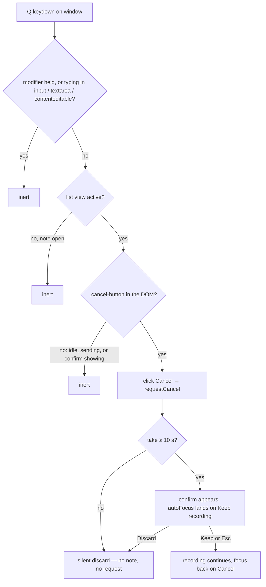

# Q Discard Shortcut and Keyboard Legend - Plan

## Goal Capsule

- **Objective:** Add `Q` as a global keyboard shortcut that discards an in-progress recording through the existing discard-confirm flow, give that confirm Esc-parity with the delete confirm, and surface the full keyboard map (`R`, `Q`, `/`, `Esc`) as a quiet always-visible legend on the landing page — with README, AGENTS.md, and DESIGN.md keymap docs updated in the same change.
- **Authority:** this plan's Product Contract, then AGENTS.md conventions (Focus Doctrine, docs-sync rule, TypeScript conventions), then implementer judgment on details the plan leaves open.
- **Execution profile:** frontend-only (`frontend/src/`) plus three documentation files. Backend untouched. No new dependencies.
- **Stop conditions:** stop and surface (rather than invent a new mechanism) if `Q` cannot reuse the established selector-click pattern, or if the legend cannot be built from existing design tokens.
- **Tail ownership:** implementer runs the Verification Contract and leaves all changes uncommitted; the user owns commit, message, and PR.

---

## Product Contract

### Summary

Pressing `Q` mid-recording cancels the take exactly as the on-screen Cancel button does (silent discard under 10 s, inline confirm at or over), `Esc` backs out of that confirm the way it backs out of the delete confirm, and a monochrome one-line shortcuts legend under the capture surface makes the whole keyboard map discoverable in-app.

### Problem Frame

Recording starts and stops from the keyboard (`R`), but discarding a dud take requires reaching for the mouse — the Cancel button has no shortcut and, unlike Record/Stop and search, no `aria-keyshortcuts`/`title` hint. Separately, the keyboard map lives only in the README: a user inside the app has no visible way to discover the shortcuts (hover titles surface them only one control at a time). Both gaps cut against the product's capture-first, keyboard-friendly posture.

### Requirements

**Shortcut behavior**

- R1. Pressing `Q` on the list view while a recording is in progress requests a cancel exactly as the on-screen Cancel button does.
- R2. The existing threshold is preserved: a take under 10 s discards silently (no note, no network request); a take at or over 10 s shows the existing inline discard confirm.
- R3. `Q` is inert everywhere else: while typing in a field, with Cmd/Ctrl/Alt held, while the discard confirm is showing, when no recording is active, and on the open-note view — the same guard set `R` obeys.
- R4. `Esc` pressed inside the recorder's discard confirm keeps recording and returns focus to the Cancel button, matching the delete confirm's Esc behavior.
- R5. The Cancel button advertises its shortcut (`aria-keyshortcuts="q"`, `title="Cancel (Q)"`) the way Record/Stop and search already do.

**In-app documentation**

- R6. The landing page shows a quiet, always-visible legend of the four shortcuts (`R` record/stop, `Q` discard, `/` search, `Esc` step back), placed so it never competes with the Record button, monochrome per DESIGN.md, and hidden along with the list when a note is open.

**Docs sync**

- R7. README's "Using it" shortcut table, AGENTS.md's keyboard-map line, and DESIGN.md's keyboard prose all include `Q` in the same change as the code.

### Acceptance Examples

- AE1. **Covers R1, R2.** Given a recording started 5 s ago, when `Q` is pressed, the recording discards silently: UI returns to ● Record and no upload request is made.
- AE2. **Covers R2.** Given a recording started 15 s ago, when `Q` is pressed, "Discard this recording?" appears, focus lands on "Keep recording", and the recording continues (timer keeps counting).
- AE3. **Covers R3.** Given the discard confirm is showing, when `Q` is pressed again, nothing changes — discarding the only copy stays an explicit Discard activation.
- AE4. **Covers R3.** Given focus is in the search box during a recording, when `q` is typed, the letter lands in the query and the recording continues.
- AE5. **Covers R4.** Given the discard confirm is showing, when `Esc` is pressed, the confirm collapses, the recording continues, and focus returns to the Cancel button.

### Scope Boundaries

- No `?` help overlay and no new help-summoning shortcut — the legend is static text (confirmed at scoping).
- `Q` never confirms the discard from inside the confirm.
- No new shortcuts on the open-note view; no backend or API changes.

#### Deferred to Follow-Up Work

- State-aware contextual hints (e.g. the legend emphasizing "Q discard" only while recording).
- Pre-existing focus gap, unchanged by this work: a mouse-clicked silent cancel (< 10 s) unmounts the focused Cancel button and lets focus drop to `<body>`, against the Focus Doctrine. `Q`-triggered cancels don't move focus, so this plan neither worsens nor fixes it — worth its own small follow-up.

---

## Planning Contract

### Key Technical Decisions

- KTD1. **`Q` rides the existing list-view keydown effect in `App.tsx` and reaches the recorder via selector-click on `.cancel-button`** — the same pattern `R` uses against `.record-button, .stop-button`. No new props, refs, or events. The confirm renders no `.cancel-button`, so `Q`'s inertness during the confirm falls out of the same mechanism the existing "R can't preempt that decision" comment documents; key-repeat is self-limiting for the same reason. Extend that comment to name `Q`.
- KTD2. **All discard semantics stay inside `Recorder`'s `requestCancel`.** `Q` adds zero cancel logic of its own; the 10 s threshold (`CANCEL_CONFIRM_AFTER_MS`) remains a one-place edit.
- KTD3. **Esc-parity on the recorder confirm mirrors `DeleteNoteButton`'s confirm** (Escape → keep + refocus the trigger via `requestAnimationFrame`, with `stopPropagation` so the same press can't double as another step-back). Rationale: `Q` creates the first keyboard entrance into this confirm, and the delete confirm already defines the app's Esc-exit convention (including its no-hidden-timer WCAG stance). Blur-collapse parity is deliberately not copied — a recording confirm abandoned by focus should stay up, since the recording keeps running either way.
- KTD4. **The legend is a small static component rendered once, after the capture surface, inside the hidden-list container** — so the note-detail overlay hides it with the rest of the list and "capture before chrome" holds (nothing sits above Record). Keys render as `<kbd>` chips: 1 px `var(--border)` hairline, no shadow or fill beyond `var(--wash)` at most, label scale (0.75–0.85 rem), `var(--text)` warm-gray ink, `var(--mono)` for the key glyphs. No chroma — DESIGN.md reserves it for state. The design anchor is the printed key legend on a field recorder's faceplate: engraved, utilitarian, quiet.
- KTD5. **Legend copy reuses the app's own action vocabulary** — the words on the buttons it mirrors ("Record / Stop", "Discard", "Search", "Back"), not new synonyms, so the legend teaches the interface's existing language.

### High-Level Technical Design

The whole `Q` decision path — every branch is an existing mechanism; only the first edge is new code:

### Sources & Research

- `frontend/src/App.tsx` — the list-view keydown effect: typing/modifier guard, selector-click dispatch, and the "Neither exists during the discard confirm, so R can't preempt that decision" comment `Q` extends.
- `frontend/src/components/Recorder.tsx` — `requestCancel` / `CANCEL_CONFIRM_AFTER_MS` / confirm markup with `autoFocus` on "Keep recording" (Focus Doctrine already satisfied for a `Q`-summoned confirm).
- `frontend/src/components/DeleteNoteButton.tsx` — the confirm's Esc convention (`stopPropagation`, collapse-to-trigger refocus) U2 mirrors.
- `frontend/src/App.css` — `.confirm-hint` / `.dropzone-hint` establish the quiet-hint scale and `var(--text)` ink the legend reuses; `frontend/src/index.css` holds the tokens (`--border`, `--text`, `--wash`, `--mono`).
- DESIGN.md (Flat Field Rule, label scale, chroma reserved for state, "no nav chrome") and PRODUCT.md ("capture before chrome", "state is always honest") govern the legend's form and placement.
- `docs/solutions/` holds no applicable learnings (searched keyboard/focus/recorder/UI terms); `Q` conflicts with no existing key handling anywhere in `frontend/src/`.

---

## Implementation Units

### U1. Q shortcut wiring and Cancel-button hints

- **Goal:** `Q` cancels an in-progress recording through the existing flow, and the Cancel button advertises it.
- **Requirements:** R1, R2, R3, R5 (AE1–AE4).
- **Dependencies:** none.
- **Files:** `frontend/src/App.tsx`, `frontend/src/components/Recorder.tsx`, `frontend/src/App.test.tsx`, `frontend/src/components/Recorder.test.tsx`.
- **Approach:** add a `q`/`Q` branch beside the `r`/`R` branch in the same list-view keydown effect (do not create a second effect — cleanup/ordering must stay with the single-listener pattern), selector-clicking `.cancel-button` with `preventDefault`. Extend the existing can't-preempt comment to cover `Q`. Add `aria-keyshortcuts="q"` + `title="Cancel (Q)"` to the Cancel button in `Recorder.tsx`.
- **Patterns to follow:** the `R` branch and its guard in `App.tsx`; hint attributes on the Record/Stop buttons and the search box.
- **Test scenarios** (in `App.test.tsx`, following the existing `userEvent.keyboard` + `installMockRecorder()` + `grantMicrophone()` shape):
  - Covers AE1. Start recording with `r`, press `q` before the threshold → back to the Record button, and the upload stub was never called.
  - Covers AE2. With `Date.now` spied past `CANCEL_CONFIRM_AFTER_MS` (the `vi.spyOn(Date, 'now')` pattern from `Recorder.test.tsx`), `q` → the confirm text appears and "Keep recording" has focus; recording did not stop.
  - Covers AE3. With the confirm showing, `q` again → confirm still showing, state unchanged.
  - Covers AE4. Focus the search box mid-recording, type `q` → input value gains `q`, recording continues.
  - Edge: `q` with no recording (idle list) → no state change, no error.
  - Edge: `Cmd/Ctrl+q`-style modifier combos → ignored (assert via a `metaKey` keyboard event).
  - Regression guard: existing Cancel-by-role queries in `Recorder.test.tsx` still pass after the new attributes (title/aria-keyshortcuts must not change the accessible name).
- **Verification:** `npm test` green in `frontend/`; manual smoke — `R`, speak, `Q` lands back on Record with no note created.

### U2. Esc keeps recording on the discard confirm

- **Goal:** `Esc` inside the recorder's discard confirm means Keep, matching the delete confirm.
- **Requirements:** R4 (AE5).
- **Dependencies:** none (independent of U1; lands naturally with it).
- **Files:** `frontend/src/components/Recorder.tsx`, `frontend/src/components/Recorder.test.tsx`.
- **Approach:** mirror `DeleteNoteButton`'s confirm `onKeyDown`: Escape → `preventDefault` + `stopPropagation`, collapse the confirm, refocus the Cancel button on the next frame. Esc only — no blur-collapse (see KTD3).
- **Patterns to follow:** `onConfirmKeyDown` in `DeleteNoteButton.tsx`.
- **Test scenarios** (in `Recorder.test.tsx`, extending the existing long-take confirm test setup):
  - Covers AE5. Open the confirm (Date.now spy + Cancel click), press `Escape` → confirm gone, still recording (timer visible), focus on the Cancel button.
  - Edge: `Escape` propagation is stopped — no other handler observes it (assert a window-level listener added by the test is not invoked, or at minimum that the recording UI is unchanged beyond the collapse).
- **Verification:** `npm test` green in `frontend/`.

### U3. Shortcuts legend on the landing page

- **Goal:** the keyboard map is discoverable in-app as a quiet one-line legend.
- **Requirements:** R6.
- **Dependencies:** U1 (the legend documents `Q`).
- **Files:** `frontend/src/components/ShortcutsLegend.tsx` (new), `frontend/src/components/ShortcutsLegend.test.tsx` (new), `frontend/src/App.tsx`, `frontend/src/App.test.tsx`, `frontend/src/App.css`.
- **Approach:** a static, non-interactive component composed once in `App.tsx` directly after the capture surface, inside the hidden-list container (the note-detail overlay then hides it for free). One wrapping line of four entries — `R` Record / Stop · `Q` Discard · `/` Search · `Esc` Back — keys as `<kbd>` chips per KTD4, action words per KTD5, separators as plain middots. No `aria-hidden` (it is informative text); no heading, no border box around the whole line.
- **Patterns to follow:** `.confirm-hint` / `.dropzone-hint` for scale and ink; `views/RecordView.tsx` for how a section composes into `App.tsx`.
- **Test scenarios** (new `ShortcutsLegend.test.tsx`, plus one assertion in `App.test.tsx`):
  - Renders all four keys with their action labels (query by text; `kbd` elements present).
  - Covers R6. In `App.test.tsx`: the legend is in the document on the list view, and hidden when a note is open (reuse however existing tests assert list content hides under the overlay).
- **Verification:** `npm test` and `npm run lint` green; visual check in the running app in both themes — legend reads as quiet ink, nothing sits above or competes with ● Record.

### U4. Keymap docs sync

- **Goal:** README, AGENTS.md, and DESIGN.md all document the same keyboard map the app implements.
- **Requirements:** R7.
- **Dependencies:** U1, U2 (their behavior is what the docs describe).
- **Files:** `README.md`, `AGENTS.md`, `DESIGN.md`.
- **Approach:** add a `Q` row to README's "Using it" shortcut table ("Discard the recording — short takes discard at once; longer takes ask first"); update AGENTS.md's keyboard-map sentence (`R` record/stop, `Q` discard, `/` search, `Esc` step-out) — it also names the files the map lives in, so keep that list truthful; extend DESIGN.md's keyboard prose in the same voice it already uses.
- **Test expectation:** none — documentation only.
- **Verification:** grep all three files for the `Q` entries; re-read each touched sentence for accuracy against the shipped behavior.

---

## Verification Contract

| Gate | Command | Applies to |
| --- | --- | --- |
| Frontend tests | `cd frontend && npm test` | U1, U2, U3 |
| Lint | `cd frontend && npm run lint` | U1, U2, U3 |
| Types + build | `cd frontend && npm run build` | U1, U2, U3 |
| Docs consistency | keymap identical across app behavior, legend copy, README, AGENTS.md, DESIGN.md | U3, U4 |

Backend is untouched; `uv run pytest` is not required for these units (CI runs the full matrix on merge regardless).

---

## Definition of Done

- R1–R7 hold, with AE1–AE5 each enforced by a named test.
- All Verification Contract gates green.
- The keyboard map reads identically in five places: `App.tsx` behavior, the legend, README, AGENTS.md, DESIGN.md.
- No backend diffs; no leftover experimental or dead-end code in the diff.
- All changes left uncommitted for the user's review.
